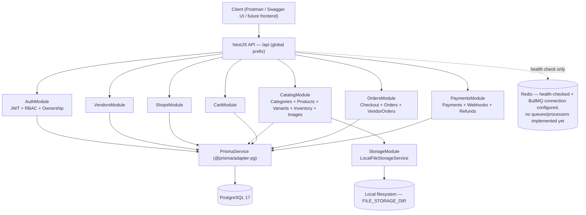

# Multi-Vendor E-Commerce API

[](https://github.com/taijulsir/multi-vendor-ecommerce-api/actions/workflows/ci.yml)

A production-oriented multi-vendor e-commerce backend built with **NestJS**, **TypeScript**, **PostgreSQL**, and **Prisma ORM**. It implements JWT authentication with refresh-token rotation, database-driven RBAC and resource-ownership authorization, a full cart → checkout → order lifecycle with atomic multi-vendor order splitting and inventory reservation, and a payment/refund/webhook foundation with idempotent event handling — including a documented and fixed refund-settlement concurrency bug, proven safe under genuine concurrent load.

Built incrementally, with unit and end-to-end test coverage added at every stage: **486 unit tests** across 44 suites and **329 end-to-end tests** across 11 suites, all passing against a real PostgreSQL database.

This is **not** a distributed/microservices system, and does **not** integrate a real payment gateway. It is a single, well-tested NestJS monolith with a clearly documented boundary between what is implemented and what is intentionally deferred — see [Implemented vs. Deferred](#implemented-vs-deferred) and [Future Scope](#future-scope).

---

## Table of Contents

- [Overview](#overview)
- [Implemented vs. Deferred](#implemented-vs-deferred)
- [Core Features](#core-features)
- [Architecture](#architecture)
- [Database](#database)
- [API Documentation](#api-documentation)
- [Setup Guide](#setup-guide)
- [Environment Variables](#environment-variables)
- [Docker](#docker)
- [Production Deployment](#production-deployment)
- [Testing](#testing)
- [Security](#security)
- [Engineering Highlights](#engineering-highlights)
- [Future Scope](#future-scope)
- [Known Limitations](#known-limitations)
- [Project Structure](#project-structure)

---

## Overview

The system has three actors:

- **Customer** — registers/logs in, builds a cart, checks out (which splits into a per-vendor order structure), views their own orders, and pays (with the payment/refund foundation described below).
- **Vendor** — a `User` who onboards as a `Vendor` (subject to ADMIN verification and activation), owns exactly one `Shop`, owns `Product`s (with `ProductVariant`s, `Inventory`, and `ProductImage`s), and views/updates the fulfillment status of their own `VendorOrder`s.
- **ADMIN** — verifies and activates vendors, manages the platform-owned `Category` taxonomy, and is the only actor who can issue refunds. ADMIN bypasses ownership checks everywhere ownership is enforced, but never bypasses RBAC/authentication itself.

**Customer flow:** register/login → browse public products/categories → add items to cart → checkout → view resulting orders → create a payment against the order → (webhook updates payment/order status).

**Vendor flow:** onboard as vendor (`PENDING`) → ADMIN verifies + activates → create shop → create products, variants, inventory, images → view/update vendor orders as they arrive.

**Multi-vendor order architecture:** one checkout produces exactly one `MasterOrder` (the customer-facing order, tracking `paymentStatus`) and one `VendorOrder` per distinct vendor represented in the cart (tracking fulfillment `status` independently per vendor). A cart with items from three different vendors becomes one `MasterOrder` with three `VendorOrder`s — this split happens inside a single database transaction, not as a follow-up step.

---

## Implemented vs. Deferred

**Implemented (API + unit + e2e tests):**

Auth & Identity · RBAC · Vendor (onboarding, verification, activation) · Shop · Category · Product · ProductVariant · Inventory · ProductImage · Cart · Checkout · MasterOrder (viewing) · VendorOrder (viewing + status update) · Payment · PaymentAttempt · Webhook ingestion · Refund · Health

**Deferred / future scope (Prisma models and migrations exist; no service or controller does):**

Wallet / Commission · Promotion / Coupon · Review · Notification · Audit · a real payment gateway integration

This split is intentional and documented per-domain under [`docs/database/`](docs/database/) — not an oversight. See [Future Scope](#future-scope).

---

## Core Features

### Authentication & Authorization

- JWT access tokens (short-lived) + opaque, HMAC-hashed-at-rest refresh tokens.
- Refresh-token rotation with reuse detection — presenting an already-rotated token revokes its entire token family.
- RBAC (`@Roles()` / `@Permissions()`), resolved live from the database on every request — no JWT-embedded claims to go stale.
- Resource-ownership authorization, enforced server-side (`User → Vendor → {Shop, Product, ProductVariant, Inventory, ProductImage, VendorOrder}`, and direct `userId` ownership for `Cart`/`MasterOrder`/`Payment`) — client-supplied `vendorId`/`userId`/`ownerId` is never trusted.
- ADMIN bypass wherever ownership is enforced, via one shared `AuthorizationService.hasRole` check.

### Vendor & Shop

- Vendor lifecycle: onboarding (`PENDING`) → `verificationStatus` (`UNDER_REVIEW`/`VERIFIED`) → `status` (`ACTIVE`), each a distinct, ADMIN-controlled transition.
- One `Shop` per vendor, unique slug, vendor-owned CRUD.
- A product's parent vendor and shop must both be usable (active/verified) before that product's variants are addable to any customer's cart.

### Catalog

- Platform-owned `Category` taxonomy (self-referential parent/child hierarchy, ADMIN-managed).
- Vendor-owned `Product`s, each with one or more `ProductVariant`s (price, SKU, currency, attributes, default-variant flag).
- `Inventory` per variant (`onHand`/`reserved`), with a full `InventoryTransaction` audit trail (restock/adjust/reserve/release).
- `ProductImage` upload (optionally scoped to a specific variant), content-sniffed and securely stored — see [Security](#security).

### Commerce

- One **active** cart per user (partial unique index), atomic upsert on repeated add-to-cart of the same variant.
- Checkout is one Prisma transaction: cart-status guard, atomic conditional-`UPDATE` inventory reservation per line, `MasterOrder` + one `VendorOrder` per vendor + `OrderItem`s + status history — all created together or not at all.
- Multi-vendor order splitting (see [Overview](#overview)).
- Vendor-order fulfillment status transitions (`PATCH /vendor-orders/:id/status`), independent of `MasterOrder.paymentStatus`.

### Payments

- Payment lifecycle foundation: `Payment` + `PaymentAttempt` state machine, retry-on-failure preserving prior attempt history.
- **No real payment gateway is integrated, by design** — `Payment.provider` is always the internal placeholder `MANUAL`.
- Unauthenticated webhook ingestion (`POST /payments/webhook`), idempotent two ways: a database unique constraint (`provider`, `eventId`) *and* a value-based check so an already-resolved attempt/refund is never re-applied even under a different event id.
- ADMIN-only refunds, amount validated against `paidAmount - refundedAmount`, never trusted as-is.
- Refund-settlement accumulation (`Payment.refundedAmount`) is an atomic conditional `UPDATE` — proven safe when two different refunds against the same payment settle genuinely concurrently (a real lost-update bug found and fixed; see [Engineering Highlights](#engineering-highlights)).

### Engineering

- Global exception filter — every unhandled error is normalized; no Prisma/SQL error ever reaches a client response.
- Graceful shutdown (`SIGTERM`/`OnModuleDestroy`) — database and Redis connections close cleanly instead of being dropped mid-request.
- Docker (multi-stage, non-root runtime user) + GitHub Actions CI (lint, format check, type-check, build, unit tests, e2e tests, Prisma validate/migrate status — all against live Postgres/Redis service containers).
- Swagger/OpenAPI, audited against a live `/api/docs-json` capture (all 54 routes verified decorated and accurate).
- A ready-to-import Postman collection + environment (17 folders / 56 requests, 18 environment variables) reflecting the real, current API.
- Secure local file storage — see [Security](#security).
- Concurrency proven with dedicated tests, not just claimed — concurrent checkout, concurrent inventory adjustment, and concurrent refund settlement.

---

## Architecture



Every module reuses the **same** authentication/authorization primitives — there is exactly one JWT guard, one RBAC guard, and one ownership-resolution service in the entire codebase, composed differently per route rather than reimplemented per domain.

A larger set of diagrams (full system diagram, commerce-flow sequence, vendor-flow sequence, and an explicit "future / not implemented" table) is in [`docs/architecture-diagram.md`](docs/architecture-diagram.md). The full narrative design-decision record is in [`docs/architecture.md`](docs/architecture.md).

### Ownership Model

Two distinct ownership shapes exist, each using the mechanism that actually fits it:

1. **Vendor-owned** (`Shop`, `Product`, `ProductVariant`, `Inventory`, `ProductImage`, `VendorOrder`) — reached through `User → Vendor → <resource>` (one hop further for Variant/Inventory/Image, resolved through their parent `Product`). Enforced by a small, purpose-specific guard per entity, all sharing `OwnershipService.getVendorIdForUser` and the same documented ADMIN bypass.
2. **User-owned** (`Cart`, `MasterOrder`, `Payment`) — a direct `userId` match, resolved in the service layer, no guard involved.

Client-supplied `vendorId`/`userId`/`ownerId` fields are **rejected outright** by the global `ValidationPipe` (`forbidNonWhitelisted: true`) wherever they aren't part of the documented DTO.

Every 401/403 response is intentionally generic — nonexistent vs. not-yours are indistinguishable to the caller, and no Prisma/SQL error is ever returned to a client.

---

## Database

Full per-domain schema, business rules, constraints, and — where implemented — the exact application contract are documented under [`docs/database/`](docs/database/), one file per domain:

| Domain | Doc | Application layer |
|---|---|---|
| Identity & Access | `identity-access.md` | ✅ Implemented |
| Vendor & Shop | `vendor-shop.md` | ✅ Implemented |
| Catalog (Category, Product, Variant, Inventory, Image) | `catalog.md` | ✅ Implemented |
| Cart | `cart.md` | ✅ Implemented |
| Order | `order.md` | ✅ Implemented (checkout, viewing, vendor-order status transitions) |
| Payment & Refund | `payment-refund.md` | ✅ Implemented (foundation; no real gateway) |
| Wallet & Commission | `wallet-commission.md` | ❌ Schema only |
| Promotion & Coupon | `promotion.md` | ❌ Schema only |
| Review | `review.md` | ❌ Schema only |
| Notification | `notification.md` | ❌ Schema only |
| Audit | `audit.md` | ❌ Schema only |

An entity-relationship diagram of every implemented model, generated by hand from the actual Prisma schema (not invented), is in [`docs/database/erd.md`](docs/database/erd.md).

The full ordered schema-implementation plan (11-domain dependency graph, migration sequencing) is in [`docs/plans/database-implementation-plan.md`](docs/plans/database-implementation-plan.md).

---

## API Documentation

- **Swagger UI** (live, generated from the running application, all 54 routes): `http://localhost:3000/api/docs`
- **OpenAPI JSON**: `http://localhost:3000/api/docs-json`
- **Narrative API walkthrough**: [`docs/API.md`](docs/API.md)
- **Architecture record**: [`docs/architecture.md`](docs/architecture.md) / [`docs/architecture-diagram.md`](docs/architecture-diagram.md)
- **Postman collection**: [`postman/multi-vendor-ecommerce-api.postman_collection.json`](postman/multi-vendor-ecommerce-api.postman_collection.json) (17 folders / 56 requests)
- **Postman environment (local)**: [`postman/multi-vendor-ecommerce-api.postman_environment.json`](postman/multi-vendor-ecommerce-api.postman_environment.json) (18 variables)
- **Postman environment (production template)**: [`postman/multi-vendor-ecommerce-api.postman_environment.production.example.json`](postman/multi-vendor-ecommerce-api.postman_environment.production.example.json) — identical variable set, `baseUrl` left as an explicit `https://YOUR_DOMAIN` placeholder to fill in once deployed (see [`docs/deployment.md`](docs/deployment.md))

**Live deployment: not yet deployed.** No live URL, hosted Swagger, or hosted API exists yet — this section will be updated with the real URL once deployment (tracked in [`docs/deployment.md`](docs/deployment.md) and [`PRODUCTION_CHECKLIST.md`](PRODUCTION_CHECKLIST.md)) is complete. Run it locally per the [Setup Guide](#setup-guide) below in the meantime.

Login/register/create-variant/upload-image/checkout/create-payment/create-refund requests in the Postman collection include test scripts that auto-capture `accessToken`, `refreshToken`, and the relevant resource id into the environment. `adminAccessToken` must still be set **manually** (no self-service admin-provisioning endpoint exists — assign the `ADMIN` role directly via Prisma, then log in as that user).

---

## Setup Guide

### Requirements

- Node.js 22 (see [`.nvmrc`](.nvmrc) — run `nvm use`)
- PostgreSQL (17, via Docker Compose below, or your own instance)
- Redis (required at startup — `REDIS_HOST`/`REDIS_PORT` are validated, and `RedisService.onModuleInit` pings on boot)
- Docker + Docker Compose (for local Postgres/Redis, and optionally to build the app image)

### Installation

```bash
npm install
```

### Environment Setup

```bash
cp .env.example .env   # fill in real local values — see Environment Variables below
```

### Infrastructure (PostgreSQL + Redis)

```bash
docker compose up -d    # starts PostgreSQL on :5433, Redis on :6379
```

### Database Setup

```bash
npx prisma generate
npx prisma migrate deploy    # applies the existing migrations
npx prisma db seed           # ADMIN / VENDOR / CUSTOMER roles (prisma/seed.ts)
```

### Development Server

```bash
npm run start:dev            # watch mode
# or
npm run build && npm run start:prod
```

### Tests

```bash
npm test -- --runInBand              # unit tests
npm run test:e2e -- --runInBand      # e2e tests (docker compose must be up)
npm run test:cov                     # coverage
```

### Swagger

```
http://localhost:3000/api/docs
```

### Postman

Import the collection and the local environment from [`postman/`](postman/) into Postman, select the environment, and run requests roughly top-to-bottom per folder — most write-capturing test scripts depend on an earlier request in the same folder having already run. Once deployed, import `multi-vendor-ecommerce-api.postman_environment.production.example.json` as a second environment and replace its placeholder `baseUrl` with the real deployed domain to run the same collection against production.

---

## Environment Variables

See [`.env.example`](.env.example) for the exact list (cross-checked against [`src/config/env.validation.ts`](src/config/env.validation.ts)). Never commit `.env`.

**Required** (application throws at startup if missing/invalid):

| Variable | Notes |
|---|---|
| `DATABASE_URL` | PostgreSQL connection string |
| `REDIS_HOST` / `REDIS_PORT` | Redis is a hard startup dependency (health check + BullMQ connection registration) |
| `JWT_ACCESS_SECRET` / `JWT_REFRESH_SECRET` | Each must be ≥32 characters and the two must differ from each other (validated at startup) |
| `JWT_ACCESS_EXPIRES_IN` / `JWT_REFRESH_EXPIRES_IN` | e.g. `15m` / `7d` |

**Optional:**

| Variable | Default | Notes |
|---|---|---|
| `PORT` | `3000` | Validated as a valid TCP port if set |
| `NODE_ENV` | — | Standard Node environment flag |
| `FILE_STORAGE_DIR` | `./storage/uploads` | **Local filesystem path only — never a cloud/object storage URL.** Used exclusively by `LocalFileStorageService` for product image uploads. In a container deployment this must point at a persistent mounted volume; a container's ephemeral filesystem otherwise loses uploads on redeploy. Rejected at startup if explicitly set to a blank/whitespace value. |

**Development-only / infrastructure-related:** `docker-compose.yml` pins local Postgres to host port `5433` (not the default `5432`) and seeds a development-only password (`ecommerce_dev_password`) — never used outside local development, and CI uses its own separate throwaway values (`.github/workflows/ci.yml`).

---

## Docker

- **`docker-compose.yml`** — local development infrastructure only: PostgreSQL 17 + Redis 7 (`docker compose up -d`). The application itself runs on the host (`npm run start:dev`) against these two services during local development; this compose file does not include the application.
- **`Dockerfile`** — a separate, multi-stage, production-oriented image for the application itself:
  - **Build stage**: installs all dependencies, runs `npx prisma generate` (Prisma 7 + `@prisma/adapter-pg`, no Rust query-engine binary to fetch), compiles TypeScript.
  - **Runtime stage**: production-only dependencies, the compiled `dist/` (which already includes the generated Prisma Client), and runs as the non-root `node` user the base image provides (not root) — standard container hardening.
  - Database migrations are a **separate release step** (`npx prisma migrate deploy`), never run automatically on container start — this image only runs the compiled application.
  - Graceful shutdown (`SIGTERM`) is handled by the application itself (`OnModuleDestroy` on `PrismaService`/`RedisService`), so a container stop closes connections cleanly rather than dropping them.

```bash
docker build -t multi-vendor-ecommerce-api .
docker run -p 3000:3000 --env-file .env multi-vendor-ecommerce-api   # point DATABASE_URL/REDIS_HOST at your actual database/Redis
```

Both the build and the resulting image have been run-verified directly (not just written): `docker build .` succeeds, and the container — run against the `docker-compose.yml` PostgreSQL/Redis — starts cleanly with `/api/health` reporting `{"database":"up","redis":"up"}`.

No Kubernetes manifests or cloud deployment configuration exist in this repository, and none are planned — the intended deployment target is a single VPS running this same Docker image behind Nginx, documented step-by-step in [`docs/deployment.md`](docs/deployment.md) (not yet executed as of this writing — see that document's own status note).

---

## Production Deployment

- **Full step-by-step guide**: [`docs/deployment.md`](docs/deployment.md) — VPS provisioning, PostgreSQL/Redis, Docker, Nginx, HTTPS, health verification, backups, rollback; written directly from this repository's own `Dockerfile`/`docker-compose.yml`/environment validation, not a generic template.
- **Execution checklist**: [`PRODUCTION_CHECKLIST.md`](PRODUCTION_CHECKLIST.md) — the practical, checkbox-driven sequence for taking this from a cloned repository to a verified live deployment.
- **Status**: not yet deployed. The target is a single VPS running this repository's existing Docker image behind Nginx — no Kubernetes, no managed cloud services, no multi-region setup, matching the actual scope of this project (see [Docker](#docker) above).

---

## Testing

**486 unit tests** (44 suites, mocked Prisma) + **329 end-to-end tests** (11 suites, real PostgreSQL) — every test in both suites passes. Coverage includes:

- Authentication (register/login/refresh/logout, rotation + reuse detection)
- RBAC and resource-ownership authorization (including spoofed-identity rejection)
- CRUD/business flows for every implemented domain
- Checkout (multi-vendor order splitting, atomic inventory reservation)
- Inventory (restock, adjustment, reservation/release)
- Payments (attempt lifecycle, retry-on-failure)
- Refunds (balance validation, settlement accumulation)
- Webhook replay protection (duplicate event id, and same-outcome-different-event-id)
- **Concurrency**: concurrent checkout (no overselling), concurrent inventory adjustment, and concurrent refund settlement (`Promise.all` against the real webhook endpoint, no artificial sleep — proving the M-1 fix below)
- File security (content-sniffed uploads, path-traversal-safe filename handling)
- Global exception handling (no Prisma/SQL error ever reaches a response)
- Graceful shutdown behavior

```bash
npm test -- --runInBand              # unit tests
npm run test:e2e -- --runInBand      # e2e tests
npm run test:cov                     # coverage
```

A known, pre-existing, non-deterministic e2e flake exists when multiple `INestApplication` instances share one Jest worker under `--runInBand` (a supertest/Node socket-reuse artifact across files, not application logic) — isolated re-runs of any single flaking file always pass. This is documented here rather than hidden.

### CI

[`.github/workflows/ci.yml`](.github/workflows/ci.yml) runs on every push/PR to `main`/`development`: checkout → Node (from `.nvmrc`) → `npm ci` → `prisma generate` → `prisma migrate deploy` → seed → lint (no `--fix`) → format check → type-check → build → unit tests → e2e tests (against real PostgreSQL + Redis service containers) → `prisma validate` / `migrate status`.

---

## Security

Implemented protections:

- JWT authentication; Argon2id password hashing; refresh tokens stored HMAC-hashed, never in plaintext.
- Refresh-token rotation with family-wide revocation on reuse detection.
- RBAC + resource ownership, both enforced server-side and never inferable from client input.
- Mass-assignment protection — global `ValidationPipe` (`whitelist: true, forbidNonWhitelisted: true`); any field not explicitly in a DTO is rejected, not silently dropped.
- DTO validation (`class-validator`/`class-transformer`) on every write endpoint.
- Prisma error sanitization — no Prisma/SQL error ever reaches a client response (global exception filter).
- Path-traversal protection on stored-file references (`LocalFileStorageService` rejects unsafe reference strings outright, verified by both unit and e2e tests).
- Magic-byte (content-based) file validation for image uploads — the client's declared Content-Type/filename is never trusted.
- Randomized storage filenames — the original client filename is never used as a stored path.
- Private/non-static file storage — images are streamed through a dedicated, visibility-aware route, never served as static files from a public directory.
- Webhook replay protection (unique constraint + value-based idempotency check).
- Atomic concurrency controls (conditional `UPDATE`s for inventory reservation, order-status transitions, and refund-settlement accumulation).
- Sensitive field exclusion — `passwordHash` and refresh-token hashes are never serialized into any response.
- Helmet baseline HTTP security headers.
- Non-disclosing error responses — 401/403 never reveal *why* (nonexistent vs. not-yours are indistinguishable).

**Explicitly not implemented** (documented gaps, not oversights):

- No rate limiting.
- No CORS policy configured (no consuming frontend origin defined in current scope).
- No WAF or secrets-manager integration.
- Webhook signature verification is not implemented (no real gateway chosen, so no provider-specific signature scheme applies yet).
- Cloud/object storage security does not apply — storage is local-filesystem only.
- `User.deletedAt` is not checked at authentication time (dormant — no account-deletion feature exists anywhere to set it).

---

## Engineering Highlights

1. **Atomic inventory reservation** — checkout reserves stock with a single conditional `UPDATE` (`WHERE onHand - reserved >= quantity`), not a SELECT-then-UPDATE, closing the race window a naive implementation would leave open under concurrent checkouts of the same variant.
2. **Concurrent checkout protection** — proven with a dedicated e2e test that fires simultaneous checkout requests against the same limited-stock variant and asserts exactly the correct number succeed.
3. **Multi-vendor order splitting** — one checkout transaction creates one `MasterOrder` plus exactly one `VendorOrder` per distinct vendor represented in the cart, with per-vendor subtotals/commission fields computed once, not re-derived later.
4. **VendorOrder ownership enforcement** — a vendor can only view/update their own `VendorOrder`s, enforced by the same ownership-guard pattern used everywhere else in the codebase, not a one-off check.
5. **Derived MasterOrder status** — `MasterOrder.paymentStatus` is synced from payment/refund outcomes; `MasterOrder.status` (fulfillment) is a separate, untouched concern by design, avoiding a single overloaded status field trying to represent two independent lifecycles.
6. **Payment/refund consistency** — refund amounts are always validated against `paidAmount - refundedAmount` computed fresh from the database, never trusted from client input or a stale read.
7. **Webhook idempotency** — a database unique constraint (`provider`, `eventId`) plus a value-based check on the target attempt/refund's current status, so the same underlying outcome reported under two different event ids still can't double-apply.
8. **M-1 refund-settlement concurrency fix** — found a genuine lost-update race in `Payment.refundedAmount` accumulation (two concurrent refund settlements could result in only one being reflected), rewrote it to the same atomic-conditional-`UPDATE` pattern already used for inventory and order-status transitions, and proved the fix with dedicated concurrent e2e tests against the real webhook endpoint.
9. **Secure local file storage** — content-sniffed uploads (`file-type`, not filename/Content-Type), randomized filenames, path-traversal-safe reference handling, isolated entirely behind `LocalFileStorageService` so no controller/service touches the filesystem directly.
10. **Global exception handling** — a single `AllExceptionsFilter` normalizes every unhandled error into a safe response shape, guaranteeing no Prisma/SQL internals ever leak to a client.
11. **Graceful shutdown** — `SIGTERM`/`OnModuleDestroy` hooks close PostgreSQL and Redis connections cleanly, verified with a dedicated e2e test rather than assumed from framework defaults.
12. **Docker non-root execution** — the production image runs as the base image's built-in non-root `node` user, with `chown` applied before the `USER` switch, applied without any application code change.
13. **CI validation** — every push/PR runs the full pipeline (lint → format check → type-check → build → unit → e2e → Prisma validate/migrate status) against real Postgres/Redis service containers, not a mocked environment.
14. **Extensive e2e testing** — 329 end-to-end tests across 11 domain suites against a real PostgreSQL database, not an in-memory or mocked substitute, covering full request/response flows and cross-user/cross-vendor isolation.

---

## Future Scope

The following domains have complete Prisma models, migrations, and architecture documentation under [`docs/database/`](docs/database/), but **no application layer** — intentionally deferred, not an oversight, pending resolution of their own documented open questions (e.g. commission-rate source, refund-request workflow, notification delivery channel):

- **Wallet / Commission** — vendor payout ledger and commission-rate application.
- **Promotion / Coupon** — discount codes and vendor/category-scoped promotions.
- **Review** — customer product reviews tied to a delivered `OrderItem`.
- **Notification** — delivery-channel-agnostic user notifications.
- **Audit** — a dedicated, queryable audit log (distinct from the status-history tables that already exist for orders).
- **A real payment gateway** — no provider (Stripe/SSLCommerz/bKash/...) is integrated; the current `Payment`/`PaymentAttempt`/webhook model is a provider-agnostic foundation designed to have one plugged in.

These are presented as roadmap items building on a working, tested core — not evidence the project is unfinished by oversight.

---

## Known Limitations

- No real payment gateway integration — foundation only; no webhook signature verification (provider-specific, no provider chosen).
- No default-variant reassignment and no image reordering/single-primary-image enforcement (`ProductVariant`/`Inventory`/`ProductImage` management itself is implemented).
- No customer-facing order cancellation, post-`PROCESSING` cancellation, or returns workflow (vendor-initiated fulfillment status transitions are implemented).
- No rate limiting, structured logging framework, or secrets-management integration.
- No CORS policy configured.
- `PaymentsService.createRefund`'s refundable-balance check (`paidAmount - refundedAmount`) is a plain read-then-decide validation, not an atomic conditional `UPDATE` — two concurrent ADMIN refund-*creation* requests against the same payment could both pass validation against the same stale balance. Narrower and lower-severity than the M-1 settlement bug above (which is fixed); intentionally left unfixed as out of scope for this phase.
- No LICENSE file is currently present in this repository — a license has not yet been chosen.

---

## Project Structure

```text
src/
├── auth/               # JWT, RBAC, ownership (shared by every other module)
├── vendors/             # Vendor onboarding, verification, activation
├── shops/               # Shop creation/retrieval/update
├── catalog/
│   ├── categories/      # Platform-owned taxonomy (ADMIN-managed)
│   ├── products/        # Vendor-owned products
│   ├── product-variants/ # Variants + inventory (restock/adjust)
│   └── product-images/   # Secure upload/stream/delete
├── cart/                # Active-cart CRUD
├── orders/
│   ├── checkout.*        # Cart → Order
│   ├── orders.*           # Customer order viewing
│   └── vendor-orders.*    # Vendor order viewing + status update
├── payments/
│   ├── payments.*        # Payment/Attempt/Refund
│   └── webhooks.*         # Unauthenticated event ingestion
├── health/              # DB/Redis health check
├── storage/             # LocalFileStorageService (product images)
├── prisma/              # PrismaService (driver adapter)
├── redis/               # RedisService (health check + BullMQ connection)
├── config/              # Environment validation
├── common/filters/       # Global exception filter
└── generated/prisma/    # Generated Prisma Client (gitignored)

prisma/
├── schema/              # One .prisma file per domain (11 domains)
├── migrations/           # One migration per domain + refresh-token additions
└── seed.ts               # ADMIN/VENDOR/CUSTOMER role seed

test/
├── *.e2e-spec.ts         # One suite per domain, real PostgreSQL
└── jest-e2e.json

docs/
├── architecture.md       # The running design-decision record
├── architecture-diagram.md # Mermaid system/commerce/vendor-flow diagrams
├── database/              # One architecture doc per domain + erd.md
├── project-profile.md     # Resume/portfolio material
├── plans/                 # Prisma schema implementation plan
└── API.md                 # Flow-level API walkthrough

postman/                  # Collection + environment
```
