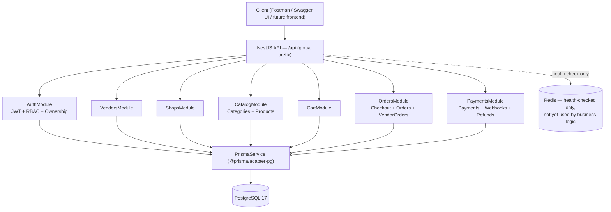
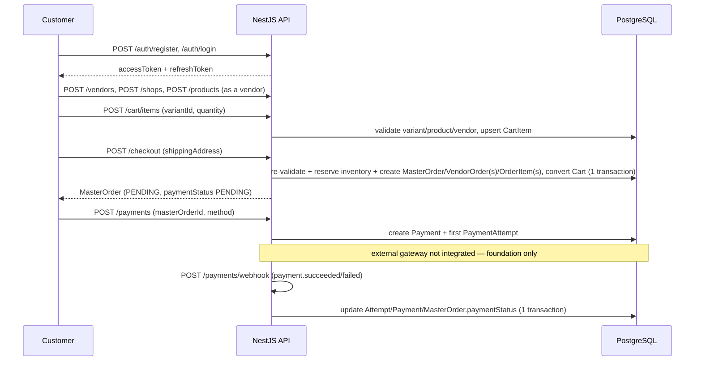

# Multi-Vendor E-Commerce API

A production-oriented multi-vendor e-commerce backend built with **NestJS**, **PostgreSQL**, and **Prisma 7**, implementing JWT authentication with refresh-token rotation, RBAC, resource ownership isolation, a full cart → checkout → order lifecycle with atomic inventory reservation, and a payment/refund/webhook foundation with replay-safe idempotency.

Built incrementally across 16 application-layer phases, each backed by its own domain architecture document under [`docs/database/`](docs/database/) and validated with unit + end-to-end tests against a real PostgreSQL database.

---

## Overview

The database schema covers 11 domains (Identity & Access, Vendor & Shop, Catalog, Cart, Order, Payment & Refund, Wallet & Commission, Promotion & Coupon, Review, Notification, Audit). **Not every domain has an application layer yet** — this README is explicit about which is which. See [Known Limitations](#known-limitations).

**Implemented (API + tests):** Auth, RBAC, Vendor, Shop, Category, Product, Cart, Checkout, Order viewing, Payment/PaymentAttempt/Webhook, Refund.

**Schema only, no API (explicitly deferred):** ProductVariant/Inventory management, Wallet/Commission, Promotion/Coupon, Review, Notification, Audit. Their Prisma models and migrations exist; no service or controller does.

---

## Architecture



Every module reuses the **same** authentication/authorization primitives — there is exactly one JWT guard, one RBAC guard, and one ownership-resolution service in the entire codebase, composed differently per route rather than re-implemented per domain. See [Ownership Model](#ownership-model) and [`docs/architecture.md`](docs/architecture.md) for the full design record, including every documented architectural decision made across all 16 phases.

---

## Core Features

- **JWT authentication** — Argon2id password hashing, short-lived access tokens, opaque refresh tokens.
- **Refresh-token rotation with reuse detection** — a replayed refresh token revokes its entire token family.
- **RBAC** — role/permission-based authorization (`@Roles()`, `@Permissions()`) fully decoupled from resource ownership.
- **Resource ownership isolation** — `User → Vendor → {Shop, Product, VendorOrder}` and directly user-owned resources (`Cart`, `MasterOrder`, `Payment`) each enforced server-side; client-supplied `userId`/`vendorId`/`ownerId` is never trusted.
- **Multi-vendor catalog** — vendor-owned Shops and Products, platform-owned Category taxonomy.
- **Cart → Checkout → Order lifecycle** — cart validation is explicitly *not* order validation; checkout re-validates price/currency/vendor/product state fresh from the database.
- **Atomic inventory reservation** — a single conditional `UPDATE` (not SELECT-then-UPDATE) reserves stock during checkout, with a documented multi-vendor Master/Vendor order split.
- **Payment lifecycle** — Payment/PaymentAttempt state machine, retry-on-failure preserving attempt history, ADMIN-only refunds bounded by the actual refundable balance.
- **Webhook replay protection** — idempotent via the database's own unique constraint plus a second, value-based idempotency guard (an already-resolved attempt/refund is never re-applied, even under a different event id).
- **Prisma transactions used precisely where atomicity is required** — never blanket-wrapped, always documented per call site.
- **Extensive automated testing** — every phase shipped with unit tests (mocked Prisma) and end-to-end tests (real PostgreSQL via Testcontainer-free Docker Compose).

---

## Tech Stack

- Node.js 22 LTS, TypeScript, NestJS 11
- PostgreSQL 17, Prisma ORM 7 (`prisma-client` generator + `@prisma/adapter-pg` driver adapter)
- Passport + `@nestjs/jwt` (JWT), Argon2id (`argon2`) for password hashing
- Redis (`ioredis`) + BullMQ — infrastructure configured and health-checked; **not yet used by any business logic** (no queues/processors exist)
- class-validator / class-transformer, global `ValidationPipe` (whitelist + forbidNonWhitelisted)
- Swagger / OpenAPI (`@nestjs/swagger`)
- Jest + Supertest (unit + e2e)
- Docker Compose (PostgreSQL + Redis)
- Helmet (baseline HTTP security headers)

---

## System Flow



---

## Authentication & Authorization

| Layer | Mechanism | Where |
|---|---|---|
| Authentication | JWT access token (short-lived) + opaque refresh token (HMAC-hashed at rest, rotated on every use, family-revoked on reuse) | `src/auth/` |
| RBAC | `@Roles()` / `@Permissions()` decorators, `AuthorizationGuard`, `AuthorizationService` (roles/permissions read live from the DB every request — no JWT-embedded claims) | `src/auth/authorization/`, `src/auth/guards/authorization.guard.ts` |
| Resource ownership | `OwnershipService` (+ one small mirrored guard per vendor-owned entity: `VendorShopOwnershipGuard`, `ProductOwnershipGuard`, `VendorOrderOwnershipGuard`) for `User → Vendor → X` resources; direct `userId` comparison in the service layer for user-owned resources (`Cart`, `MasterOrder`, `Payment`) | `src/auth/authorization/ownership.service.ts`, `src/auth/guards/` |

Seeded roles: `ADMIN`, `VENDOR`, `CUSTOMER` (`prisma/seed.ts`). There is no self-service admin-provisioning endpoint — assigning `ADMIN` requires direct database/Prisma access, by design (no documented business rule defines a self-service path).

Every 401/403 response is intentionally generic — the API never discloses *why* a resource is inaccessible (nonexistent vs. not-yours are indistinguishable), and no Prisma/SQL error is ever returned to a client.

---

## Ownership Model

Two distinct ownership shapes exist in this codebase, and each uses the *correct* mechanism rather than one generic abstraction forced onto both:

1. **Vendor-owned** (`Shop`, `Product`, `VendorOrder`) — reached through `User → Vendor → <resource>`. Enforced by a small, purpose-specific guard per entity, all sharing `OwnershipService.getVendorIdForUser` and the same documented `ADMIN` bypass (`AuthorizationService.hasRole`). A generic `OwnershipGuard<T>` was deliberately *not* built — see `docs/architecture.md`'s Ownership Scope notes for the reasoning, including the explicit point at which extracting one would become justified.
2. **User-owned** (`Cart`, `MasterOrder`, `Payment`) — a direct `userId` match, resolved in the service layer, no guard involved.

Client-supplied `vendorId`/`userId`/`ownerId` fields are **rejected outright** by the global `ValidationPipe` (`forbidNonWhitelisted: true`) wherever they aren't part of the documented DTO — they are never silently ignored, and never trusted even where accepted for other reasons.

---

## Cart & Checkout

- One **active** cart per user, enforced by a partial unique index (`UNIQUE(userId) WHERE status = 'ACTIVE'`).
- Adding an already-present variant increments its quantity (atomic `upsert` on `UNIQUE(cartId, variantId)`) rather than creating a duplicate row.
- Cart validation (add-item time) and checkout validation (order-creation time) are deliberately separate — checkout never trusts the cart's own prior price/availability checks, re-validating product/variant/vendor/currency/inventory fresh.
- Checkout is one Prisma transaction: atomic cart-status guard (`ACTIVE → CONVERTED`, doubling as the retry/duplicate-checkout protection), atomic conditional-`UPDATE` inventory reservation per line, and creation of `MasterOrder` + one `VendorOrder` per distinct vendor + `OrderItem`s + status history.
- Multi-vendor split: one checkout, one `MasterOrder`, one `VendorOrder` per vendor represented in the cart — exactly the documented Master/Vendor order model.

---

## Order Management

- `GET /orders`, `GET /orders/:id` — the customer's own `MasterOrder`s (ADMIN bypass).
- `GET /vendor-orders`, `GET /vendor-orders/:id` — a vendor's own `VendorOrder`s (ADMIN bypass, ownership-guarded).
- Order *creation* (checkout) and order *viewing* were implemented in separate phases; fulfillment status transitions/cancellation are **not implemented** — the source documents defer the exact transition matrix to a later phase.

---

## Payment / Refund / Webhook

**No real payment gateway is integrated, by design.** `Payment.provider` is always the internal placeholder `MANUAL`; `PaymentAttempt`/`Refund` `providerReference` values are generated internally rather than returned by a real processor. This is a documented, intentional foundation — not an oversight.

- `POST /payments` — one Payment (+ first `PaymentAttempt`) per order; amount/currency always come from the order, never the client.
- `POST /payments/:id/retry` — a new attempt on a `FAILED` payment only, preserving every prior attempt.
- `POST /payments/webhook` — **unauthenticated** (a real gateway is not a logged-in user). Idempotent two ways: the database's own `UNIQUE(provider, eventId)` constraint, *and* a value-based check (an already-resolved attempt/refund is never re-applied, even under a different event id — closing a gap the constraint alone can't).
- `POST /payments/:id/refunds` — **ADMIN-only** (no customer-facing refund-request workflow is documented anywhere in the source docs); amount is always validated against `paidAmount - refundedAmount`, never trusted as-is.
- Only `MasterOrder.paymentStatus` is synced on payment/refund outcomes — `MasterOrder.status` (fulfillment) is a separate, untouched concern, per the documented domain boundary.
- **Webhook signature verification is explicitly not implemented** — the source docs tie the exact mechanism to "the provider," which is undefined since no gateway is integrated. This is a real, deliberately documented security gap, not a missed requirement.

---

## API Documentation

Interactive Swagger UI (all real, protected, and public endpoints, generated directly from the running application) is available at:

```
http://localhost:3000/api/docs
```

A narrative walkthrough of every flow (auth, cart, checkout, orders, payments/refunds/webhooks) is in [`docs/API.md`](docs/API.md).

---

## Postman Collection

A ready-to-import collection and environment reflecting the real, current API (37 requests across the 12 implemented domains, in call order) are in [`postman/`](postman/):

- `postman/multi-vendor-ecommerce-api.postman_collection.json`
- `postman/multi-vendor-ecommerce-api.postman_environment.json`

Login/register/checkout/create-payment/create-refund requests include test scripts that automatically capture `accessToken`, `refreshToken`, and the relevant resource id into the environment. Two variables must be set **manually**, since no endpoint exists to obtain them: `variantId` (no `ProductVariant` creation API — create one via `prisma/seed.ts` or Prisma Studio) and `adminAccessToken` (no self-service admin-provisioning endpoint — assign the `ADMIN` role directly via Prisma, then log in as that user). See the collection's own description for details.

---

## Project Structure

```text
src/
├── auth/              # JWT, RBAC, ownership (shared by every other module)
├── vendors/            # Vendor onboarding
├── shops/              # Shop creation/retrieval/update
├── catalog/
│   ├── categories/     # Platform-owned taxonomy (ADMIN-managed)
│   └── products/       # Vendor-owned products
├── cart/               # Active-cart CRUD
├── orders/
│   ├── checkout.*       # Cart → Order
│   ├── orders.*          # Customer order viewing
│   └── vendor-orders.*   # Vendor order viewing
├── payments/
│   ├── payments.*       # Payment/Attempt/Refund
│   └── webhooks.*        # Unauthenticated event ingestion
├── health/             # DB/Redis health check
├── prisma/             # PrismaService (driver adapter)
├── redis/              # RedisService (health check only)
├── config/             # Environment validation
└── generated/prisma/   # Generated Prisma Client (gitignored)

prisma/
├── schema/             # One .prisma file per domain (11 domains)
├── migrations/          # One migration per domain + refresh-token additions
└── seed.ts              # ADMIN/VENDOR/CUSTOMER role seed

test/
├── *.e2e-spec.ts        # One suite per domain, real PostgreSQL
└── jest-e2e.json

docs/
├── architecture.md      # The running design-decision record across all 16 phases
├── database/             # One architecture doc per domain (source of truth)
├── plans/                 # Prisma schema implementation plan
└── API.md                # Flow-level API walkthrough

postman/                # Collection + environment
```

---

## Database Architecture

Full per-domain schema, business rules, constraints, and — where implemented — the exact application contract are documented under [`docs/database/`](docs/database/), one file per domain, each kept in sync with the actual implementation as it landed:

| Domain | Doc | Application layer |
|---|---|---|
| Identity & Access | `identity-access.md` | ✅ Implemented |
| Vendor & Shop | `vendor-shop.md` | ✅ Implemented |
| Catalog (Category, Product) | `catalog.md` | ✅ Implemented (Category, Product only — Variant/Image/Inventory management not implemented) |
| Cart | `cart.md` | ✅ Implemented |
| Order | `order.md` | ✅ Implemented (checkout + viewing; fulfillment transitions not implemented) |
| Payment & Refund | `payment-refund.md` | ✅ Implemented (foundation; no real gateway) |
| Wallet & Commission | `wallet-commission.md` | ❌ Schema only |
| Promotion & Coupon | `promotion.md` | ❌ Schema only |
| Review | `review.md` | ❌ Schema only |
| Notification | `notification.md` | ❌ Schema only |
| Audit | `audit.md` | ❌ Schema only |

The full ordered schema-implementation plan (11-domain dependency graph, migration sequencing, and every schema-level implementation decision) is in [`docs/plans/database-implementation-plan.md`](docs/plans/database-implementation-plan.md).

---

## Environment Variables

See [`.env.example`](.env.example) for the complete, exact list (cross-checked against `src/config/env.validation.ts`). Copy it to `.env` and fill in real local values — never commit `.env`.

---

## Local Development

### Prerequisites

- Node.js 22 (see `.nvmrc` — run `nvm use`)
- npm
- Docker + Docker Compose

### Setup

```bash
npm install
cp .env.example .env        # fill in real local values
docker compose up -d         # starts PostgreSQL (5433) + Redis (6379)
npx prisma generate
npx prisma migrate deploy    # applies the existing migrations
npx prisma db seed           # ADMIN / VENDOR / CUSTOMER roles
```

### Running

```bash
npm run start:dev            # watch mode
npm run build && npm run start:prod   # production build
```

### Testing

```bash
npm test -- --runInBand              # unit tests (mocked Prisma)
npm run test:e2e -- --runInBand      # e2e tests (real PostgreSQL, docker compose must be up)
npm run test:cov                     # coverage
```

### Swagger

```
http://localhost:3000/api/docs
```

### Postman

Import both files from `postman/` into Postman (collection + environment), select the environment, and run requests roughly top-to-bottom per folder — most write-capturing test scripts depend on an earlier request in the same folder having already run.

---

## Testing

Every phase (1–16) shipped with:

- **Unit tests** — every service/controller/guard, mocked Prisma, including ownership isolation, spoofed-identity rejection, DB-error propagation, and Prisma unique-constraint race handling.
- **E2E tests** — one suite per domain against a real PostgreSQL database, covering full request/response flows, cross-user/cross-vendor isolation, and error semantics (401/403/400/404/409).

```bash
npm test -- --runInBand
npm run test:e2e -- --runInBand
```

A known, pre-existing, non-deterministic e2e flake exists when multiple `INestApplication` instances share one Jest worker under `--runInBand` (a supertest/Node socket-reuse artifact across files, not application logic) — isolated re-runs of any single flaking file always pass. This has been true since early phases and is documented here rather than hidden.

### CI

`.github/workflows/ci.yml` runs on every push/PR to `main`/`development`: checkout → Node (from `.nvmrc`) → `npm ci` → `prisma generate` → `prisma migrate deploy` → seed → lint (no `--fix`) → format check → type-check → build → unit tests → e2e tests (against real PostgreSQL + Redis service containers) → `prisma validate` / `migrate status`.

---

## Docker

- `docker-compose.yml` — local development infrastructure only: PostgreSQL 17 + Redis 7 (`docker compose up -d`). The application itself is intended to run on the host (`npm run start:dev`) against these two services during local development.
- `Dockerfile` — a separate, multi-stage, production-oriented image for the application itself (deps → `prisma generate` + `nest build` → a slim `node:22-alpine` runtime with production-only dependencies and the compiled `dist/`). Database migrations are a distinct release step (`npx prisma migrate deploy`), not run automatically on container start.

Both have been verified directly, not just written: `docker build .` succeeds, and the resulting image — run standalone against the `docker-compose.yml` PostgreSQL/Redis with explicit environment variables — starts cleanly and its `/api/health` endpoint reports `{"database":"up","redis":"up"}`.

```bash
docker build -t multi-vendor-ecommerce-api .
docker run -p 3000:3000 --env-file .env multi-vendor-ecommerce-api   # point DATABASE_URL/REDIS_HOST at your actual database/Redis
```

---

## Security

- Argon2id password hashing; refresh tokens stored HMAC-hashed, never in plaintext.
- Refresh-token rotation with family-wide revocation on reuse detection.
- Global `ValidationPipe` (`whitelist: true, forbidNonWhitelisted: true`) — any client-supplied field not explicitly in a DTO is rejected, not silently dropped.
- No client-controlled `userId`/`vendorId`/`ownerId`/price/amount/status field is ever accepted where server authority is required (verified explicitly in unit tests for every write endpoint).
- Helmet baseline HTTP security headers enabled.
- Non-disclosing error responses (401/403 never reveal *why*; no Prisma/SQL error ever reaches a client response).

**Known, documented gaps** (not oversights — see `docs/architecture.md` and each domain doc's Implementation Status for the reasoning):

- No CORS policy configured — no consuming frontend origin is defined in the current scope.
- No rate limiting.
- Webhook signature verification not implemented (no real gateway chosen yet).
- `User.deletedAt` is not checked at authentication time (dormant — no account-deletion feature exists anywhere to set it).

---

## Known Limitations

- No real payment gateway integration (Stripe/SSLCommerz/bKash/...) — foundation only.
- `ProductVariant`/`ProductImage`/`Inventory` have no management API — variants must be seeded directly.
- Wallet/Commission, Promotion/Coupon, Review, Notification, and Audit have Prisma models and full architecture docs, but **no application layer** — not implemented, not stubbed, not faked.
- No order fulfillment status-transition or cancellation workflow.
- No CI pipeline was present before this pass — see `.github/workflows/` for what now exists.

## Future Scope

Implementing the deferred domains above, once their outstanding business-rule ambiguities are resolved (e.g., commission rate source, refund-request workflow, notification delivery channel) — see each domain's `docs/database/*.md` for the specific open questions already on record.
