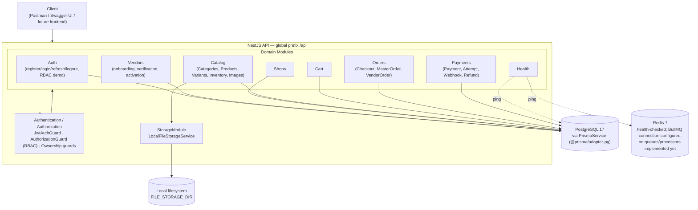
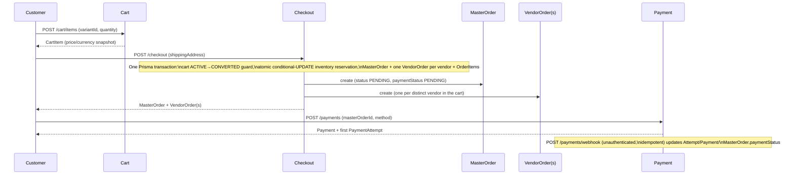
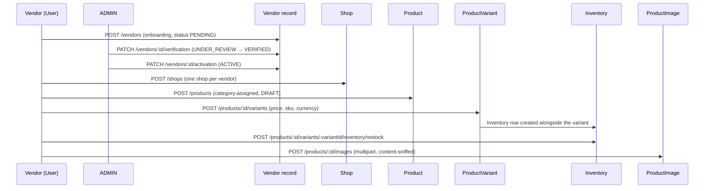

# Architecture Diagrams

This document contains the visual companion to [`docs/architecture.md`](architecture.md) (the full design-decision record). All diagrams below reflect the *actually implemented* system as of the current state — nothing here depicts a deferred domain or a capability that doesn't exist in `src/`.

---

## 1. System Architecture

**Notes, so this diagram cannot be misread:**

- Every module funnels through the *same* authentication/authorization primitives — there is exactly one JWT guard, one RBAC guard, and one ownership-resolution service in the codebase, composed per-route rather than reimplemented per domain.
- **Redis is real infrastructure** (`RedisModule` is global, `RedisService` pings on startup/shutdown, `docker-compose.yml` and CI both run a Redis service container) — but its *only* current consumer is the `/api/health` endpoint and the `BullModule.forRootAsync` connection registration in `app.module.ts`. No queue, processor, or cache read/write exists anywhere in `src/`. This diagram does not draw Redis as a caching or queueing layer because it isn't one yet.
- **Local file storage is isolated behind `LocalFileStorageService`** — no controller or service touches the filesystem directly; uploads are validated by content (magic-byte sniffing via `file-type`), stored under a randomized filename, and streamed back through a dedicated route rather than served as static files.
- **No external payment gateway box is drawn.** `PaymentsModule` talks only to PostgreSQL — `Payment.provider` is the internal placeholder `MANUAL`, and the webhook endpoint ingests events with no real processor on the other end. A future gateway would sit outside this diagram entirely until one is actually integrated.

---

## 2. Commerce Flow (Customer)

Fulfillment (shipping/delivery) is tracked at the `VendorOrder` level (`PATCH /vendor-orders/:id/status`), independently of `MasterOrder.paymentStatus` — the two lifecycles are a deliberate domain separation, not an oversight.

---

## 3. Vendor Flow

**A cart-add (`POST /cart/items`) only succeeds once the Product, its parent Vendor, *and* the specific ProductVariant are all `ACTIVE`** — a vendor that is onboarded but not yet verified/activated cannot have its products added to any customer's cart, by design.

---

## 4. Future / Not Implemented

The following are **explicitly not part of the current runtime** and are never drawn as active components above:

| Item | Status |
|---|---|
| Real payment gateway (Stripe/SSLCommerz/bKash/...) | Not integrated — `Payment.provider` is always `MANUAL` |
| Webhook signature verification | Not implemented — no real provider chosen yet |
| BullMQ queues/processors | Connection configured only; zero queues defined |
| Wallet / Commission, Promotion / Coupon, Review, Notification, Audit | Prisma models exist; no service or controller |
| CDN / object storage (S3, Spaces, MinIO) for images | Local filesystem only |
