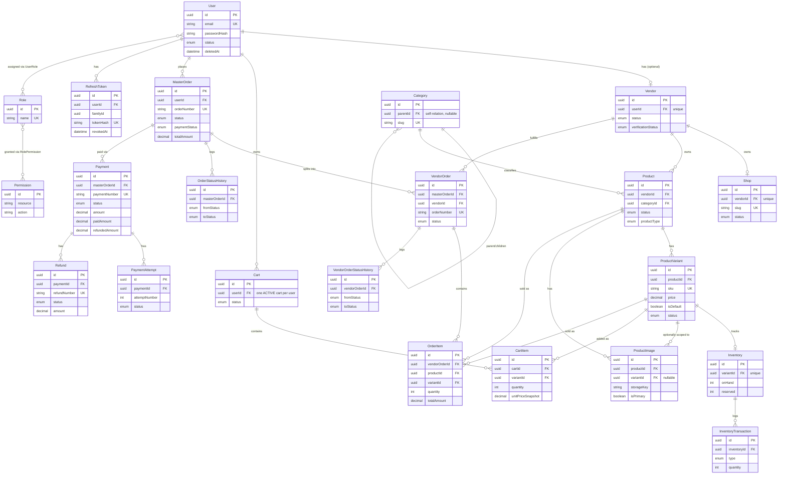

# Entity-Relationship Diagram

This ER diagram covers the entities backing the **implemented** application layer. It is generated by hand from the actual Prisma schema (`prisma/schema/*.prisma`), not from a tool, and only shows relationships that exist as real `@relation` fields in that schema — nothing is inferred or invented.

Deferred-domain models (`Wallet`, `Commission`, `Promotion*`, `Coupon*`, `Review`, `Notification`, `AuditLog`) exist in the schema but are intentionally omitted here since they have no application layer — see the [README's Future Scope](../../README.md#future-scope). `User`/`Vendor`/`Product`/`MasterOrder` each have a few relation fields pointing at those deferred models (e.g. `User.reviews`, `Vendor.wallet`); those fields are visible in the schema files but not drawn below to keep this diagram focused on what's actually built.

## Deliberately-not-drawn relationship: `PaymentWebhookEvent`

`PaymentWebhookEvent` (the raw inbound webhook ledger — `provider`, `eventId`, `eventType`, `payload`, `status`) has **no Prisma `@relation` field to `Payment`, `PaymentAttempt`, or `Refund`**. It is deliberately schema-independent of them: its only uniqueness guarantee is `@@unique([provider, eventId])`, and it is matched to a `Payment`/`Refund` at the *application layer* (`WebhooksService`) by comparing `providerReference` values, not by a foreign key.

Drawing a Mermaid ER edge from `PaymentWebhookEvent` to `Payment` would misrepresent the schema as having referential-integrity enforcement that does not exist — this is why it's called out here in text instead of forced into the diagram above. This is intentional: a webhook event must be recordable even if it never matches anything (an unmatched/malformed event, logged and left `RECEIVED`, per `WebhooksService`'s replay-protection design), which a mandatory FK would prevent.

## Cardinality notes

- `User ||--o| Vendor` — a `User` has **at most one** `Vendor` record (`Vendor.userId` is `@unique`); most users have none.
- `Vendor ||--o| Shop` — likewise **at most one** `Shop` per `Vendor` (`Shop.vendorId` is `@unique`).
- `ProductVariant ||--o| Inventory` — **exactly one** `Inventory` row per variant once created (`Inventory.variantId` is `@unique`); a variant can exist briefly without one only between its own creation and the inventory row being provisioned in the same request.
- `User }o--o{ Role` and `Role }o--o{ Permission` are genuine many-to-many join tables (`UserRole`, `RolePermission`), each with a composite primary key, not a single-FK relation.
- `Category ||--o{ Category` is a self-referential parent/child hierarchy (`Category.parentId → Category.id`), nullable at the root.
