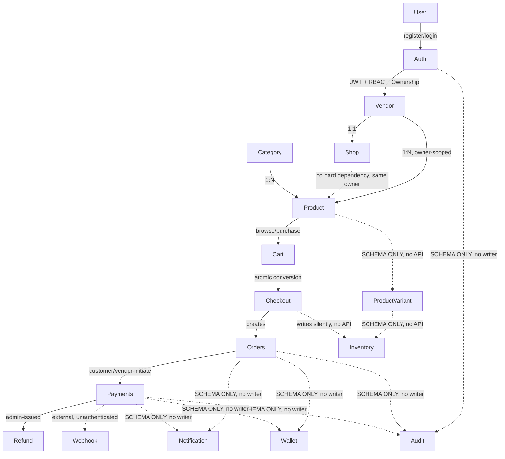
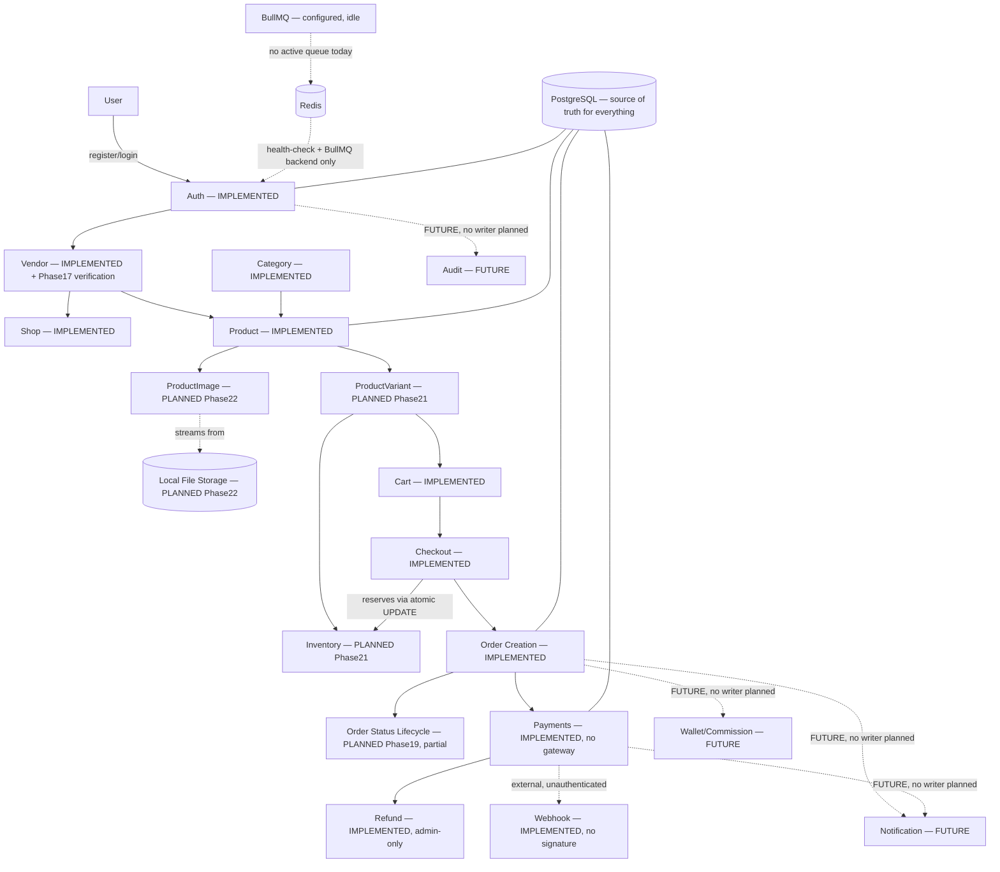

# Remaining Architecture & Implementation Plan

```text
Document type    ARCHITECTURE + PLANNING ONLY — no code, schema, migration,
                  or Postman changes were made while producing this document
Prepared          2026-08-20
Based on          docs/project-completion-audit.md (primary current-state
                   audit), cross-referenced directly against
                   docs/architecture.md, docs/API.md, README.md,
                   docs/plans/database-implementation-plan.md, all 11
                   docs/database/*.md files, prisma/schema/*.prisma,
                   src/**, test/**, postman/**, Dockerfile,
                   docker-compose.yml, .github/workflows/, eslint.config.mjs,
                   package.json, .env.example
Status of P0/P1   Phase 17 (P0.1, Vendor Verification/Activation)
                   IMPLEMENTED as of 2026-08-22 — see Section 6's Phase 17
                   entry and `docs/database/vendor-shop.md` §22.
                   Phases 18-26 NOT started; this document remains the plan
                   for all remaining work.
Baseline           2026-08-22 — Architecture Decision Register added below;
                    four decisions locked by explicit project-owner approval
                    (see register). ADR-1 through ADR-4 remain APPROVED and
                    unmodified; only ADR-1's corresponding phase (17) has
                    since been implemented — the register itself records
                    decisions, not implementation status, and is not
                    rewritten here.
```

---

# Architecture Decision Register

```text
Purpose   Permanent, authoritative record of architecture decisions the
           project owner has explicitly approved. Once a decision appears
           here as APPROVED, it is locked: future phases (17-26) implement
           it as specified and do not reopen, re-derive, or ask for
           reconfirmation. Only the project owner can change an APPROVED
           decision's status.
Scope     Only decisions actually approved are recorded here. This
           register does not manufacture new decisions beyond what has
           been explicitly approved or was already independently
           established elsewhere in the repository's own documentation
           (cited by source in each entry).
```

## Decision 1 — Vendor Verification / Activation

| Field | Value |
|---|---|
| **Decision ID** | ADR-1 |
| **Decision** | Verification and activation are two separate ADMIN-only administrative operations, not a single generic status-update endpoint. |
| **Status** | **APPROVED** |
| **Approved behavior** | `PATCH /api/vendors/:vendorId/verification` — ADMIN-only, transitions `Vendor.verificationStatus`. `PATCH /api/vendors/:vendorId/activation` — ADMIN-only, transitions `Vendor.status`. Vendor users cannot verify or activate themselves (no self-service path). No KYC/document-upload functionality is introduced — no such field exists anywhere in `Vendor`'s Prisma model, and none is added by this decision. No vendor re-application behavior after rejection is defined by this decision. |
| **Affected phase(s)** | Phase 17. |
| **Source/basis** | `docs/database/vendor-shop.md` §6 ("Verification and activation may be implemented as separate service operations so that the business rules remain explicit") + explicit project-owner approval of the exact two-endpoint shape and ADMIN-only gating. |
| **Implementation constraints** | Use the existing `VendorStatus`/`VendorVerificationStatus` Prisma enums as-is (no schema change). Reuse the existing `@Roles('ADMIN')` + `AuthorizationGuard` pattern already used identically on `POST /payments/:paymentId/refunds` — no new authorization mechanism. **Remaining genuinely unresolved (not covered by this approval, tracked in Section 22):** the precise `verificationStatus` transition matrix (`PENDING → UNDER_REVIEW → VERIFIED` vs. allowing `PENDING → VERIFIED` directly; whether `REJECTED` is terminal or re-openable) is not fully specified by `vendor-shop.md` §6 beyond the general `PENDING/UNDER_REVIEW → REJECTED` shape — Phase 17 must implement only the transitions the source doc actually states and mark the rest deferred, not invent the full matrix. Idempotency behavior of re-applying an already-current status is likewise unresolved. |

## Decision 2 — Order Status Lifecycle (VendorOrder)

| Field | Value |
|---|---|
| **Decision ID** | ADR-2 |
| **Decision** | `VendorOrder` fulfillment status may progress only along the narrow, explicitly-approved path. No cancellation-from-active-fulfillment or return workflow is in scope for this MVP. |
| **Approved behavior** | `VendorOrderStatus`: `PENDING → CONFIRMED → PROCESSING → READY_TO_SHIP → SHIPPED → DELIVERED` (using the actual Prisma enum, `prisma/schema/enums.prisma:92-102`). Cancellation is approved only where `docs/database/order.md` already explicitly and unconditionally states it (`PENDING → CANCELLED`, `CONFIRMED → CANCELLED`). **Explicitly NOT approved, do not implement:** `PROCESSING → CANCELLED`, `SHIPPED → CANCELLED`, any `RETURN_REQUESTED`/`RETURNED` transition, any `MasterOrderStatus.COMPLETED` transition, and any refund-driven fulfillment transition. These remain **DEFERRED**, not merely blocked — this is an approved decision to exclude them from the current MVP scope, not an open question. |
| **Status** | **APPROVED** |
| **Affected phase(s)** | Phase 19. |
| **Source/basis** | `docs/database/order.md` §10 (VendorOrderStatus enum definition), §31 (illustrative cancellation table, narrowed by this decision to only its unconditional entries) + explicit project-owner approval to exclude every transition `order.md` itself already flagged as undefined ("depends on business rules," "normally not directly cancelled," return/exchange explicitly future scope per §55). |
| **Implementation constraints** | Every transition must write an immutable `VendorOrderStatusHistory` row recording `fromStatus`/`toStatus`/`changedBy` — table already exists, no schema change. Transitions are vendor-actor-initiated (via `VendorOrderOwnershipGuard`, already exists) except cancellation of `PENDING`/`CONFIRMED`, which per `order.md` §48 a customer may also be able to trigger for their own `MasterOrder` — the exact customer-vs-vendor-initiated split for cancellation is an implementation detail Phase 19 resolves, not a business rule this decision leaves open. |

## Decision 3 — MasterOrder Status Derivation

| Field | Value |
|---|---|
| **Decision ID** | ADR-3 |
| **Decision** | `MasterOrder.status` is never directly client- or vendor-settable. It is always derived server-side from the aggregate state of its child `VendorOrder`s. |
| **Status** | **APPROVED** |
| **Approved behavior** | Using the actual Prisma enum (`prisma/schema/enums.prisma:72-80`): all relevant child `VendorOrder`s at `DELIVERED` → `MasterOrder.status = FULFILLED`. Some but not all children have progressed/reached `DELIVERED` while others remain incomplete → `MasterOrder.status = PARTIALLY_FULFILLED`. Otherwise, an aggregate state appropriate to the children's actual progress (`PENDING`/`CONFIRMED`/`PROCESSING`, following the same ordering as `VendorOrderStatus`) — the precise bucket-by-bucket mapping for every possible combination of child statuses is an implementation detail for Phase 19 to define consistently with this approved principle, not a second independent state machine. No endpoint accepts a client-supplied `MasterOrder.status` value. |
| **Affected phase(s)** | Phase 19. |
| **Source/basis** | `docs/database/order.md` §7 ("the MasterOrder status must not simply be updated independently without considering its child VendorOrders") + explicit project-owner approval of the derive-not-set principle and the `FULFILLED`/`PARTIALLY_FULFILLED` mapping for the two clearly-defined aggregate cases. |
| **Implementation constraints** | No new endpoint should accept `status` as a writable `MasterOrder` field. Derivation runs as part of the same transaction that writes a `VendorOrder` status change (reuse the `$transaction` pattern already established in `CheckoutService`/`PaymentsService`). `MasterOrder → CANCELLED` remains scoped to the case where every child `VendorOrder` is still cancellable (per ADR-2), not derived independently. |

## Decision 4 — Inventory Authorization / Adjustment

| Field | Value |
|---|---|
| **Decision ID** | ADR-4 |
| **Decision** | Inventory ownership and mutation authorization follow the same vendor-ownership-chain pattern already used for Shop/Product/VendorOrder, extended one hop further through `ProductVariant`. |
| **Status** | **APPROVED** |
| **Approved behavior** | Ownership chain: `User → Vendor → Product → ProductVariant → Inventory` (`docs/database/catalog.md` §50, verbatim). A vendor may view/restock/adjust inventory belonging to their own `ProductVariant`s; cross-vendor access is denied using the same generic-403 pattern already used everywhere else. ADMIN follows the existing project-wide ADMIN-bypass convention (`AuthorizationService.hasRole`) where the guard pattern already applies it elsewhere. **Inventory adjustment is vendor-self-service (not ADMIN-only)** — this resolves the ambiguity the audit previously flagged, since `catalog.md` §43/§51 describes manual adjustment as something a vendor performs and records, not an admin-exclusive action. Every adjustment creates an `InventoryTransaction` row with `type = ADJUSTMENT`, `createdBy = <authenticated user id>` — never a client-supplied identity field. Negative adjustments are allowed but the resulting `onHand` must never go negative — enforced both at the application layer (clean 409/422 rejection before the write) and by the already-existing DB-level `CHECK` constraints (`onHand >= 0`, `reserved >= 0`, `reserved <= onHand`, per `docs/plans/database-implementation-plan.md` Final Decisions §9) as a last-line defense. No Redis or distributed locking is introduced — every inventory mutation reuses the same single atomic conditional-`UPDATE` pattern already proven correct in `CheckoutService`, never SELECT-then-UPDATE. |
| **Affected phase(s)** | Phase 21. |
| **Source/basis** | `docs/database/catalog.md` §47 (concurrency — atomic operations required, no naive SELECT-then-UPDATE), §50 (ownership chain), §51 (security considerations, manual-adjustment recording) + explicit project-owner approval resolving the vendor-vs-ADMIN authorization ambiguity in favor of vendor-self-service with ADMIN bypass. |
| **Implementation constraints** | Reuse `OwnershipService`'s existing resolution pattern (`getVendorIdForUser` + an entity-specific ownership query, mirroring `isShopOwnedByVendor`/`isProductOwnedByVendor`/`isVendorOrderOwnedByVendor`) rather than inventing a new authorization mechanism. `userId`/`ownerId`/`vendorId` are never accepted from the client for authorization purposes, consistent with every existing DTO in this codebase. |

## Previously Established Decisions (Reference Only, Not New)

Recorded here for completeness per this task's instruction to include
"other already-established architectural decisions from the existing
audit where appropriate" — none of these are new; each already exists in
its cited source and is restated here only as a pointer, not re-derived.

| Decision | Status | Source |
|---|---|---|
| Local filesystem storage only — no S3/Spaces/Cloudinary | APPROVED | Explicit project instruction, restated in `docs/project-completion-audit.md` Part 6 and this document's Section 8 |
| Ownership guards stay mirrored per-entity, not generalized into one abstraction | APPROVED (deliberately not revisited) | `docs/architecture.md` §23 |
| UUID v7, snake_case DB mapping, `Decimal(14,2)` money precision, sequence-based order/payment/refund numbers, selective DB `CHECK` constraints | APPROVED | `docs/plans/database-implementation-plan.md`, "Final Decisions" section |
| BullMQ configured as infrastructure, no queue/processor built until a concrete async need exists | APPROVED (intentionally idle) | `docs/architecture.md` §11/§27 |
| No CORS policy until a real consuming frontend origin is defined | APPROVED (deferred, not a gap) | `src/main.ts` comment, confirmed in `docs/project-completion-audit.md` Part 5/§10 |

---

# Section 1 — Document Purpose

This document exists because `docs/project-completion-audit.md` answered
*"what is the current state?"* — this document answers *"what exactly should
happen next, in what order, and with what boundaries?"* It is the single
place a future session (human or Claude) should read before writing any
code for Phase 17 onward, instead of re-deriving the same conclusions from
scratch across a dozen files.

**This document is architecture/planning only.** No source file, Prisma
schema, migration, or Postman collection was modified while producing it.

**Precedence rule:** for describing *current* state, the actual source code
and `prisma/schema/*.prisma` are always authoritative over this document —
if they ever disagree, the code is right and this document is stale and
needs updating. For describing *planned/remaining* work, this document is
the source of truth going forward, superseding ad-hoc re-derivation.

**Business rules are never invented here.** Every place the source
documentation (`docs/database/*.md`) leaves a rule genuinely undefined, this
plan says so explicitly with `BLOCKED — BUSINESS DECISION REQUIRED` rather
than picking a plausible-sounding default. Section 22 consolidates every
such item into one table.

---

# Section 2 — Current Architecture

The implemented (not merely schema-defined) call graph, verified against
`src/app.module.ts` and every controller/service read during the audit:



**Important deviation from the task's illustrative example:** `Notification`
and `Audit` are correctly modeled as observer-style domains in the *schema*
(loosely coupled via `type`/`resourceType` strings, not hard FKs into every
domain — confirmed in `docs/plans/database-implementation-plan.md` Part 2's
own rationale). But **neither has any writer today** — no implemented
domain (not Auth, not Orders, not Payments) actually emits a `Notification`
or `AuditLog` row. The dotted lines above represent architectural intent
recorded in `docs/architecture.md`, not existing behavior. This distinction
matters for Section 15/17: audit logging cannot be claimed as "in place,"
even partially, until at least one domain writes to it.

`Wallet`/`Commission` is drawn hanging off `Orders`/`Payments` for the same
reason — `VendorOrder.commissionAmount`/`vendorNetAmount` columns exist and
are always `0` (no commission rate exists anywhere in the persisted data
model), and no `WalletTransaction` is ever created.

---

# Section 3 — Current Implementation Matrix

| Domain | Prisma | Application | API | Tests | Integrated | Current Status | Resume Claim |
|---|:---:|:---:|:---:|:---:|:---:|---|---|
| Health | ✅ | ✅ | ✅ | ✅ | ✅ | IMPLEMENTED | safe |
| Identity & Access | ✅ | ✅ | ✅ | ✅ | ✅ | IMPLEMENTED | safe |
| Vendor | ✅ | ✅ | ✅ create/view + verification/activation (Phase 17) | ✅ | ✅ | IMPLEMENTED (narrow transition matrix — see `docs/database/vendor-shop.md` §22) | safe |
| Shop | ✅ | ✅ | ✅ | ✅ | ✅ | IMPLEMENTED | safe |
| Category | ✅ | ✅ | ⚠️ no list-pagination convention used | ✅ | ✅ | IMPLEMENTED | safe |
| Product | ✅ | ✅ | ⚠️ no list endpoint | ✅ | ✅ | IMPLEMENTED (core fields) | safe, narrowly (see §17) |
| Product Variant | ✅ | ❌ | ❌ | ❌ | ⚠️ silently written by checkout's FK only | SCHEMA ONLY | do not claim |
| Product Image | ✅ | ❌ | ❌ | ❌ | ❌ | SCHEMA ONLY | do not claim |
| Inventory | ✅ | ⚠️ written inside checkout tx | ❌ | ⚠️ covered only via checkout e2e | ⚠️ | SCHEMA ONLY (no standalone layer) | do not claim |
| Cart | ✅ | ✅ | ✅ | ✅ | ✅ | IMPLEMENTED | safe |
| Checkout | ✅ | ✅ | ✅ | ✅ | ✅ | IMPLEMENTED | safe |
| Order Creation | ✅ | ✅ | ✅ | ✅ | ✅ | IMPLEMENTED | safe |
| Order Viewing | ✅ | ✅ | ✅ | ✅ | ✅ | IMPLEMENTED | safe |
| Order Status Lifecycle | ✅ (enums + history tables) | ❌ | ❌ | ❌ | ❌ | SCHEMA ONLY | do not claim |
| Payment | ✅ | ✅ | ✅ | ✅ | ✅ | IMPLEMENTED (no gateway) | safe, narrowly (see §17) |
| Refund | ✅ | ✅ | ✅ | ✅ | ✅ | IMPLEMENTED (admin-issued only) | safe, narrowly |
| Webhook | ✅ | ✅ | ✅ | ✅ | ✅ | IMPLEMENTED (no signature verification) | safe, narrowly |
| Wallet | ✅ | ❌ | ❌ | ❌ | ❌ | SCHEMA ONLY | do not claim |
| Commission | ✅ | ❌ | ❌ | ❌ | ❌ | SCHEMA ONLY | do not claim |
| Promotion | ✅ | ❌ | ❌ | ❌ | ❌ | SCHEMA ONLY | do not claim |
| Coupon | ✅ | ❌ | ❌ | ❌ | ❌ | SCHEMA ONLY | do not claim |
| Review | ✅ | ❌ | ❌ | ❌ | ❌ | SCHEMA ONLY | do not claim |
| Notification | ✅ | ❌ | ❌ | ❌ | ❌ | SCHEMA ONLY | do not claim |
| Audit | ✅ | ❌ | ❌ | ❌ | ❌ | SCHEMA ONLY | do not claim |

---

# Section 4 — What Is Already Complete (Do Not Rebuild)

Every item below is verified against current source, not assumed from the
prior audit's word:

- **JWT access/refresh authentication** with rotation and reuse detection
  (`src/auth/auth.service.ts`, `src/auth/token/refresh-token.service.ts`).
- **Argon2id password hashing** (`src/auth/password/password.service.ts`).
- **RBAC** with live DB re-evaluation, OR-semantics for multi-role,
  AND-semantics for multi-permission (`src/auth/authorization/`,
  `src/auth/guards/authorization.guard.ts`).
- **Three mirrored ownership guards** (`VendorShopOwnershipGuard`,
  `ProductOwnershipGuard`, `VendorOrderOwnershipGuard`) sharing
  `OwnershipService`. **Do not generalize these into one abstraction** —
  `docs/architecture.md` §23 already explains why this was deliberately
  deferred; see Section 18.
- **Vendor creation, Shop CRUD, Category CRUD, Product create/view/update**
  — all owner-scoped, all tested, all Swagger-complete.
- **Vendor verification/activation (Phase 17, ADR-1)** — two ADMIN-only
  endpoints (`PATCH /vendors/:vendorId/verification`,
  `PATCH /vendors/:vendorId/activation`), the exact narrow transition
  matrix ADR-1/Phase 17 committed to (see §6's update note in
  `docs/database/vendor-shop.md`), tested (unit + e2e), Swagger-complete.
  **Do not rebuild or reopen the transition matrix** — re-verification out
  of `REJECTED`, skipping `UNDER_REVIEW`, and reactivation from
  `SUSPENDED`/`FROZEN` remain deliberately unimplemented, not forgotten.
- **Cart** — atomic add-item transaction, one-active-cart-per-user partial
  unique index, price always server-derived.
- **Checkout** — atomic multi-vendor order split, race-safe inventory
  reservation via a single conditional `UPDATE` (not SELECT-then-UPDATE).
- **Order viewing** (customer + vendor perspectives, ADMIN bypass).
- **Payment/Refund/Webhook foundation** — two-layer webhook idempotency
  (`UNIQUE(provider, eventId)` + target-status re-check), refund amount
  always validated against `paidAmount - refundedAmount`.
- **Docker** (multi-stage `Dockerfile`, verified built+run in a prior
  session), **`docker-compose.yml`** (Postgres 17 + Redis 7, dev infra
  only).
- **CI** (`.github/workflows/ci.yml` — real Postgres/Redis services, full
  lint/format/typecheck/build/unit/e2e/prisma-validate pipeline).
- **Swagger** — all 40 current operations fully decorated, re-verified this
  session.
- **Postman** — `postman/multi-vendor-ecommerce-api.postman_collection.json`
  + `_environment.json`, 12 folders, 34 real endpoints + 3 webhook payload
  variants, auto-capture scripts on the key flows (see Section 12 for the
  exact current inventory).
- **README.md**, **`docs/API.md`**, **`docs/architecture.md`**, all 11
  `docs/database/*.md` — all independently re-verified accurate against
  source this session and the prior audit session.
- **300 unit tests / 218 e2e tests**, all green, including adversarial
  scenarios (ownership spoofing, concurrent-refresh-token race, duplicate
  webhook delivery, logout idempotency).

**Do not re-litigate any of the above.** Any future phase touching these
areas should be additive (new endpoint, new guard usage) not a rewrite,
unless a genuine defect is found.

---

# Section 5 — Remaining MVP Architecture

## P0 — Must complete

### P0.1 — Vendor Verification / Activation

- **Domain:** Vendor & Shop.
- **Goal:** let an ADMIN move a vendor through
  `PENDING → UNDER_REVIEW → VERIFIED` (or `→ REJECTED`), and separately
  activate a verified vendor (`status: PENDING → ACTIVE`).
- **Why needed:** every vendor created today is permanently `PENDING`
  (`src/vendors/vendors.controller.ts:37`) — this is the most visible
  half-finished claim in an otherwise complete domain.
- **Dependencies:** none new.
- **Existing infrastructure to reuse:** `@Roles('ADMIN')` +
  `AuthorizationGuard` (already used identically on
  `POST /payments/:paymentId/refunds`); `VendorStatus`/
  `VendorVerificationStatus` enums already exist in
  `prisma/schema/vendor-shop.prisma`.
- **Expected API surface:** an ADMIN-gated verification-transition endpoint
  and a separate activation endpoint (see rationale in `docs/database/
  vendor-shop.md` §6 — "Verification and activation may be implemented as
  separate service operations so that the business rules remain
  explicit").
- **Database models involved:** `Vendor` (existing, no schema change).
- **Security considerations:** `@Roles('ADMIN')` only; must not let a
  vendor self-verify; must use the existing generic-403 pattern.
- **Testing:** unit + e2e for each transition, invalid-transition
  rejection (e.g. `REJECTED → VERIFIED` directly), non-admin rejection.
- **Documentation impact:** `docs/database/vendor-shop.md` §22
  Implementation Status, `docs/API.md`, README Core Features, Postman
  folder `03 Vendors`.
- **Complexity:** low.
- **Resume value:** high — completes an already-claimed domain rather than
  opening a new one.
- **Ambiguity:** the endpoint shape is **APPROVED — ADR-1** (two separate
  ADMIN-only endpoints, `PATCH /vendors/:vendorId/verification` +
  `PATCH /vendors/:vendorId/activation`, not a combined status endpoint).
  Only the precise transition matrix beyond the general shape and
  idempotency-on-reapply remain open (Section 22, narrow, non-blocking).

### P0.2 — Order Status Lifecycle (Partial — Only the ADR-2/ADR-3-Approved Transitions)

- **Domain:** Order.
- **Goal:** implement exactly the `VendorOrder`/`MasterOrder` transitions
  locked by **ADR-2** and **ADR-3** in the Architecture Decision Register,
  and leave everything else explicitly deferred (not blocked — the
  exclusion itself is now a decision, not an open question).
- **Why needed:** every order today is permanently `PENDING` — "order
  management" cannot be credibly claimed with zero lifecycle movement.
- **Dependencies:** none new — `VendorOrderStatus`/`MasterOrderStatus`
  enums and both status-history tables already exist and are unused.
- **Existing infrastructure to reuse:** `VendorOrderOwnershipGuard` (vendor
  actions), ADMIN bypass pattern (admin actions), `$transaction` pattern
  already established in `CheckoutService`/`PaymentsService`.
- **Expected API surface:** see Section 9 for the exact transition matrix
  this phase can and cannot implement.
- **Database models involved:** `MasterOrder`, `VendorOrder`,
  `OrderStatusHistory`, `VendorOrderStatusHistory` (no schema change — all
  four already exist and are already written-to for the *initial* status
  only).
- **Security considerations:** every transition must record `changedBy`;
  vendor actions scoped to own `VendorOrder` only; MasterOrder status is
  **APPROVED as derived-only, never client-settable (ADR-3)**.
- **Testing:** unit + e2e per transition, invalid-transition rejection,
  ownership checks per actor type (customer/vendor/admin).
- **Documentation impact:** `docs/database/order.md` §58, `docs/API.md`,
  README Order Management, Postman folders `09 Orders`/`10 Vendor Orders`.
- **Complexity:** medium.
- **Resume value:** high.
- **Ambiguity:** **low-medium — resolved by ADR-2/ADR-3, see Section 9.**
  The transition scope itself is locked: the narrow `VendorOrder`
  progression plus early-state cancellation is approved; `PROCESSING`/
  `SHIPPED` cancellation and return flows are approved *exclusions*, not
  open questions. The only remaining narrow item is which actor
  (customer, vendor, or both) may trigger the approved early-state
  cancellation — tracked in Section 22, does not block starting this
  phase.

### P0.3 — Concurrent Checkout E2E Proof

- **Domain:** Checkout (test-only — zero application code change).
- **Goal:** one e2e test that fires two genuinely simultaneous
  `POST /checkout` HTTP requests against inventory with exactly one unit
  available, asserting exactly one request succeeds and the other fails
  cleanly (insufficient stock, not a 500).
- **Why needed:** the atomic conditional-`UPDATE` mechanism is implemented
  and correct (verified by code inspection in the audit), but nothing in
  the current test suite actually proves it under real concurrent load —
  every existing checkout test is sequential.
- **Dependencies:** none.
- **Complexity:** low — this is the cheapest, highest-credibility item in
  the entire remaining plan.
- **Resume value:** high — this is the specific artifact that turns "I
  designed for concurrency" into "I proved it."

## P1 — Strongly recommended

### P1.4 — Product / Category List Endpoints

- **Goal:** `GET /products` and `GET /categories` with the pagination
  envelope already specified in `docs/architecture.md` §16
  (`{ data: [], meta: { page, limit, total, totalPages } }`) but never
  implemented for these two resources.
- **Why needed:** a catalog with no browse/list endpoint cannot be
  meaningfully demoed.
- **Complexity:** low.
- **Security considerations:** public product list must filter to
  `status: ACTIVE, deletedAt: null` only (matching the existing
  slug-lookup pattern); no vendor-internal (DRAFT/ARCHIVED) products
  should leak into an unauthenticated list.

### P1.5 — Product Variant + Inventory Management API

- **Goal:** make `Product` genuinely purchasable end-to-end through the
  API — see Section 7 for the full design.
- **Complexity:** medium-high — the single largest remaining implementation
  item in this plan.
- **Resume value:** high, but expensive — flagged for explicit
  prioritization discussion against P0 items before starting (this plan
  recommends doing all of P0 first regardless).

### P1.6 — Secure Local File Storage + Product Image API

- **Goal:** implement the storage design from
  `docs/project-completion-audit.md` Part 6, restated and finalized in
  Section 8 below.
- **Dependencies:** conceptually independent of P1.5 (an image can attach
  to a `Product` without variants existing), but ownership-guard reuse is
  cleanest once the Catalog module's guard patterns are settled by P1.5.
- **Complexity:** medium.

### P1.7 — Global Exception Filter

- **Goal:** consistent error envelope for genuinely unexpected
  (non-service-translated) errors. NestJS's default handler is already
  confirmed safe (no Prisma/SQL leakage — audited), so this is a
  consistency improvement, not a security fix.
- **Complexity:** low.

### P1.8 — Graceful Shutdown

- **Goal:** `app.enableShutdownHooks()` + SIGTERM handling draining
  Prisma/Redis connections before process exit.
- **Complexity:** low.

## P2 — Optional / nice-to-have

- **Rate limiting** (`@nestjs/throttler`) on auth/checkout/payment routes.
- **Orphan-file cleanup job** for local file storage (only relevant once
  P1.6 ships) — candidate for the already-configured, currently-unused
  BullMQ infrastructure.
- **ESLint strictness restoration** — `eslint.config.mjs:29-31` currently
  disables `no-explicit-any` globally and downgrades two other rules to
  warnings; tightening these back to strict defaults and fixing whatever
  surfaces is low-risk, low-urgency cleanup.
- **Wallet/Commission read-only view** — genuinely `BLOCKED — BUSINESS
  DECISION REQUIRED` (commission rate/type is never specified as a
  concrete number anywhere), listed here only as "worth doing once
  unblocked," not as actionable P2 work today.

## FUTURE — intentionally deferred (not part of this MVP)

Promotion/Coupon engine, Review/Rating system, Notification delivery,
Audit logging, real payment gateway integration, 2FA/email verification,
multi-currency/regional pricing, warehouse/multi-location inventory. Each
requires business decisions (discount stacking rules, moderation policy,
delivery channels, retention policy, gateway choice) this plan will not
invent. See Section 22.

---

# Section 6 — Required Remaining Phases

The candidate sequence in the task prompt (Phases 17–26) is verified
against actual dependencies below. **Two adjustments from the literal
prompt order:** Phase 18 (concurrent-checkout test) is resequenced to run
immediately after Phase 17 rather than waiting, since it has zero
dependencies and is the cheapest possible credibility win — no reason to
defer it. Phase 21 (Variant/Inventory) and Phase 22 (Image storage) keep
their relative order, but this plan notes they are not strictly
sequential-dependent on each other (see P1.6 above) — doing them in
parallel across two sessions would also be valid if that's ever useful.
Everything else in the prompt's proposed order is confirmed correct by
dependency analysis.

## Phase 17 — Vendor Verification / Activation

- **Objective:** implement P0.1.
- **In scope:** ADMIN-gated verification transition(s) + activation
  transition, per `docs/database/vendor-shop.md` §6.
- **Out of scope:** vendor self-service re-application after rejection
  (undefined by source docs), document/KYC upload (no such field exists in
  `Vendor` schema).
- **Dependencies:** none.
- **Files/modules likely affected:** `src/vendors/vendors.controller.ts`,
  `src/vendors/vendors.service.ts`, new DTO(s), `src/vendors/vendors.
  service.spec.ts`, `src/vendors/vendors.controller.spec.ts`, `test/
  vendors.e2e-spec.ts` (currently does not exist as a dedicated file —
  creating one here is reasonable, or extending the vendor-creation
  coverage already embedded in `shops.e2e-spec.ts`).
- **API changes:** 1-2 new ADMIN-gated endpoints under `/vendors`.
- **Schema impact:** none — `Vendor.status`/`Vendor.verificationStatus`
  already exist.
- **Migration impact:** none.
- **Security impact:** new ADMIN-only mutation surface; must follow the
  existing generic-403/ownership-guard-free-but-role-gated pattern already
  used by `POST /payments/:paymentId/refunds`.
- **Test requirements:** every valid transition, every rejected invalid
  transition, non-admin 403, idempotency of re-applying the same
  transition (should it be a no-op or a conflict? — flagged in Section
  22 if not decided before implementation).
- **Documentation requirements:** `docs/database/vendor-shop.md` §22,
  `docs/API.md`, README, Postman folder `03 Vendors`.
- **Completion criteria:** vendor created via `POST /vendors` can reach
  `status=ACTIVE` through documented, tested API calls; all existing
  vendor/shop tests still pass unmodified.
- **Risk/ambiguity:** low risk; endpoint shape is APPROVED (ADR-1) and no
  longer open. Only the narrow items in Section 22 (precise transition
  matrix, re-apply idempotency) remain, neither of which blocks starting
  this phase.

> **STATUS: IMPLEMENTED (2026-08-22).** Both endpoints exist exactly as
> planned above, at `src/vendors/vendors.controller.ts`/
> `vendors.service.ts`, with `src/vendors/dto/update-vendor-verification.dto.ts`
> (activation takes no body). Files affected matched the prediction above
> except the e2e coverage: it was added to the existing
> `test/shops.e2e-spec.ts` (already contains a `Vendors + Shops API`
> describe block covering vendor onboarding) rather than a new
> `test/vendors.e2e-spec.ts` file, since a dedicated vendor e2e file did
> not otherwise exist and splitting it out would have fragmented existing
> coverage for no benefit. The re-apply-idempotency question was resolved
> narrowly for this phase (not deferred): re-applying an already-current
> state, or any transition with no documented outgoing arrow, is treated
> as an invalid transition (409), not a no-op — see this phase's final
> report for the full reasoning. 32 new unit tests + 22 new e2e tests
> added, all passing; full suite (325 unit / 240 e2e) green;
> `npx prisma validate`/`migrate status` clean with zero schema changes.

## Phase 18 — Concurrent Checkout E2E Proof

- **Objective:** implement P0.3.
- **In scope:** one new e2e test file/case; no application code changes.
- **Out of scope:** load testing, performance benchmarking.
- **Dependencies:** none.
- **Files/modules likely affected:** `test/checkout.e2e-spec.ts` only.
- **API changes:** none.
- **Schema/migration impact:** none.
- **Security impact:** none (verification only).
- **Test requirements:** this phase *is* the test requirement.
- **Documentation requirements:** none required, but worth a one-line
  mention in README's Testing section once added.
- **Completion criteria:** the new test passes reliably (not flaky) across
  multiple runs.
- **Risk/ambiguity:** none — lowest-risk phase in this plan.

## Phase 19 — Order Status Lifecycle

- **Objective:** implement P0.2 exactly as locked by ADR-2/ADR-3.
- **In scope:** the approved `VendorOrder` progression
  `PENDING → CONFIRMED → PROCESSING → READY_TO_SHIP → SHIPPED →
  DELIVERED` plus `PENDING/CONFIRMED → CANCELLED`, and derived (never
  client-settable) `MasterOrder` status (see Section 9's now-approved
  matrix); recording `OrderStatusHistory`/`VendorOrderStatusHistory` rows
  on every transition.
- **Out of scope:** every transition marked DEFERRED in Section 9 under
  ADR-2 (`PROCESSING → CANCELLED`, `SHIPPED → *`, return/return-request,
  `MasterOrder → COMPLETED`) — excluded by decision, not merely
  unimplemented; return/exchange workflows remain future-scope per
  `order.md` §55.
- **Dependencies:** none new.
- **Files/modules likely affected:** `src/orders/vendor-orders.
  controller.ts`, `src/orders/vendor-orders.service.ts`, `src/orders/
  orders.service.ts` (for MasterOrder derivation logic), new DTOs, new
  spec files, `test/orders.e2e-spec.ts`.
- **API changes:** new vendor-facing status-update endpoint(s); possibly a
  customer-facing cancel endpoint for the unambiguous early states.
- **Schema impact:** none.
- **Migration impact:** none.
- **Security impact:** vendor actions must stay scoped to own
  `VendorOrder` via the existing `VendorOrderOwnershipGuard`; MasterOrder
  status must never be directly client-settable (derived only, per §7).
- **Test requirements:** per-transition unit + e2e, invalid-transition
  rejection, cross-vendor isolation (vendor A cannot transition vendor B's
  order), MasterOrder derivation correctness for the multi-vendor partial-
  fulfillment case.
- **Documentation requirements:** `docs/database/order.md` §58, `docs/
  API.md`, README, Postman folders `09`/`10`.
- **Completion criteria:** the approved lifecycle subset (ADR-2/ADR-3) is
  reachable and tested; every excluded transition is documented as
  DEFERRED (approved exclusion) rather than silently missing.
- **Risk/ambiguity:** **low-medium** — the scope itself is now locked by
  ADR-2/ADR-3, down from the prior "medium-high, needs a business-decision
  pause." Only the narrow customer-vs-vendor cancellation-initiator split
  (Section 22) remains open, and it does not block starting this phase.

## Phase 20 — Product / Category List APIs

- **Objective:** implement P1.4.
- **In scope:** `GET /products`, `GET /categories` with the existing
  pagination envelope convention.
- **Out of scope:** search/filtering beyond basic pagination (not
  specified anywhere as required).
- **Dependencies:** none.
- **Files/modules likely affected:** `products.controller.ts`,
  `products.service.ts`, `categories.controller.ts`,
  `categories.service.ts`, their spec files, `catalog.e2e-spec.ts`.
- **API changes:** 2 new public `GET` endpoints.
- **Schema/migration impact:** none.
- **Security impact:** must exclude non-`ACTIVE`/soft-deleted rows from
  the public list (defense against accidentally exposing vendor drafts).
- **Test requirements:** pagination correctness, status/soft-delete
  filtering, empty-result handling.
- **Documentation requirements:** `docs/API.md`, README, Postman folders
  `05`/`06`.
- **Completion criteria:** both endpoints live, tested, documented.
- **Risk/ambiguity:** low.

## Phase 21 — Product Variant + Inventory Management

- **Objective:** implement P1.5 — see Section 7 for full design.
- **In scope:** Variant CRUD (owner-scoped), Inventory view + restock/
  adjust endpoints, wiring Cart/Checkout to real variant/inventory data
  instead of requiring manually-seeded rows.
- **Out of scope:** multi-location/warehouse inventory (explicit future
  scope per `catalog.md` §59); batch/serial tracking (same).
- **Dependencies:** none blocking, though logically should follow Phases
  17-20 per Section 17's sequencing rationale.
- **Files/modules likely affected:** new `src/catalog/product-variants/`
  module, new `src/catalog/inventory/` module (or folded into variants —
  implementation decision), `catalog.module.ts`, new guards reusing
  `OwnershipService`, extensive new spec/e2e coverage.
- **API changes:** the largest single API surface addition in this plan —
  see Section 11.
- **Schema impact:** none — `ProductVariant`/`Inventory`/
  `InventoryTransaction` already fully modeled.
- **Migration impact:** none.
- **Security impact:** ownership chain and vendor-self-service adjustment
  authorization are **APPROVED — ADR-4** (`User → Vendor → Product →
  ProductVariant → Inventory`, adjustment is vendor-scoped with the
  existing ADMIN-bypass convention, `createdBy` always server-derived).
  Concurrency must reuse the checkout's proven atomic-`UPDATE` pattern,
  never SELECT-then-UPDATE (`catalog.md` §47 explicit warning, also
  restated as an ADR-4 implementation constraint) — no Redis/distributed
  locking is introduced.
- **Test requirements:** ownership, SKU uniqueness, default-variant
  invariant (`catalog.md` §20/§22 — "at most one active default variant"),
  concurrent restock/reserve interaction, negative-stock prevention.
- **Documentation requirements:** `docs/database/catalog.md` §60, `docs/
  API.md`, README, Postman folders `06 Products` (extended) + new `07
  Product Variants`/`08 Inventory` (or similar).
- **Completion criteria:** a vendor can create a product, add variants
  with SKU/price/stock, and a customer can add that variant to cart and
  complete checkout with real (not manually-seeded) inventory data.
- **Risk/ambiguity:** medium — see Section 7 for the specific unresolved
  points (default-variant enforcement mechanism, attribute-validation
  scheme) marked `BLOCKED` where genuinely undefined.

## Phase 22 — Secure Local Product Image Storage + Product Image API

- **Objective:** implement P1.6 — see Section 8 for full design.
- **In scope:** upload endpoint (owner-scoped, ownership chain identical
  to Variant), validated storage, authenticated streaming endpoint.
- **Out of scope:** image processing/resizing/thumbnails (not specified
  anywhere as required), CDN integration.
- **Dependencies:** logically follows Phase 21 for guard-pattern reuse, not
  strictly blocked by it.
- **Files/modules likely affected:** new `src/catalog/product-images/`
  module, new `src/storage/` infrastructure module, new env var(s) in
  `src/config/env.validation.ts` and `.env.example`.
- **API changes:** upload/list/delete endpoints + streaming endpoint — see
  Section 11.
- **Schema impact:** none — `ProductImage` already fully modeled.
- **Migration impact:** none.
- **Security impact:** the largest net-new attack surface in this plan —
  full defense-in-depth checklist in Section 8/15.
- **Test requirements:** MIME-spoofing rejection, oversized-file
  rejection, path-traversal impossibility (structural, via random
  filenames), ownership enforcement on upload/delete/stream, orphan-file
  behavior on product/image deletion.
- **Documentation requirements:** `docs/database/catalog.md` §25/§52,
  `docs/API.md`, README (Known Limitations must gain the single-instance-
  deployment caveat from Section 8), `.env.example`, Postman folder
  addition.
- **Completion criteria:** an authenticated vendor can upload an image to
  their own product, it is retrievable through the streaming endpoint with
  correct visibility rules, and it cannot be retrieved via any other
  filesystem path.
- **Risk/ambiguity:** low-medium — the design in Section 8 is complete
  enough to implement without further business decisions; the only open
  item is the exact `FILE_STORAGE_DIR` production value, which is a
  deployment-environment detail, not a business rule.

## Phase 23 — Production Hardening

- **Objective:** implement P1.7, P1.8, and evaluate P2's rate limiting.
- **In scope:** global exception filter, graceful shutdown.
- **Out of scope (unless explicitly requested):** rate limiting — genuinely
  optional per Section 14's Portfolio-vs-Production distinction.
- **Dependencies:** none — can run any time, sequenced late because it's
  cheapest to get right once the API surface stops changing.
- **Files/modules likely affected:** `src/main.ts`, new
  `src/common/filters/` (or similar).
- **API changes:** none (error *shape* may change for previously-untranslated
  errors — verify no existing test asserts on the old shape).
- **Schema/migration impact:** none.
- **Security impact:** net positive (consistent error envelope), no new
  risk.
- **Test requirements:** exception filter unit test, shutdown-hook
  integration verification (harder to e2e-test meaningfully — manual
  verification acceptable).
- **Documentation requirements:** README Production Configuration section.
- **Completion criteria:** unhandled errors return the same envelope shape
  as service-translated ones; `SIGTERM` closes DB/Redis connections before
  exit (verifiable via Docker `docker stop` + log inspection).
- **Risk/ambiguity:** low.

## Phase 24 — Engineering Cleanup

- **Objective:** implement P2's lint-strictness item.
- **In scope:** re-enable `no-explicit-any`, restore `no-floating-promises`/
  `no-unsafe-argument` to `error`, fix whatever surfaces.
- **Out of scope:** any change to test-file-scoped relaxed rules (already
  justified in `eslint.config.mjs:36-49`'s own comment).
- **Dependencies:** should run after all other phases to avoid re-doing
  cleanup mid-flight.
- **Files/modules likely affected:** `eslint.config.mjs` +  whatever `src/`
  files the stricter rules newly flag.
- **API/schema/migration impact:** none.
- **Test requirements:** full suite must remain green.
- **Completion criteria:** `npx eslint "{src,test}/**/*.ts"` clean under
  the stricter config.
- **Risk/ambiguity:** low, but genuinely unpredictable scope until run —
  do not pre-estimate how many violations will surface.

## Phase 25 — Documentation / Postman Refresh

- **Objective:** bring README, `docs/API.md`, `docs/database/*.md`, and
  the Postman collection/environment up to date with everything Phases
  17-24 added.
- **In scope:** exactly what Section 12/13 specify.
- **Out of scope:** any content change unrelated to Phases 17-24's actual
  output.
- **Dependencies:** must run after Phases 17-22 (the phases that add API
  surface); can run once at the end rather than per-phase, at this
  project's discretion.
- **Completion criteria:** every new endpoint from Phases 17-22 appears in
  Swagger (automatic, no action needed), `docs/API.md`, README, and the
  Postman collection with working auto-capture where applicable.
- **Risk/ambiguity:** none.

## Phase 26 — Final Portfolio / Resume Audit

- **Objective:** re-run the equivalent of
  `docs/project-completion-audit.md` against the then-current repository,
  confirm every item that moved from "Cannot Claim Yet" to "Safe to Claim"
  (Section 17), and refresh resume bullets/portfolio entry accordingly.
- **In scope:** audit + documentation only, same constraints as the prior
  audit session (no code changes).
- **Completion criteria:** Section 21's Definition of Done is fully
  satisfied.

---

# Section 7 — Product Catalog Completion

## The purchasability chain

```text
Product (exists today)
   │  1:N
   ▼
ProductVariant  ← MISSING: no create/update/list/delete API
   │  1:1
   ▼
Inventory       ← MISSING: no standalone view/restock/adjust API
   │
   ├── read at Cart-add time (validate availability)
   ├── reserved at Checkout time (atomic UPDATE, already implemented
   │    mechanically inside CheckoutService — just has no variant to
   │    reserve against today because none can be created)
   └── (SALE-type InventoryTransaction, per catalog.md §39, at
        "the point... defined by the Order and Payment lifecycle" —
        not yet decided, see Section 22)
```

**A product created today cannot actually be sold.** `CartService.
addItem()` requires a `variantId`; none can ever exist without direct DB
seeding (confirmed via `prisma/seed.ts` being the only current source of
variant/inventory rows). This is the single most consequential gap in the
current MVP for a live demo — a reviewer who clicks through the Swagger UI
top-to-bottom cannot complete a purchase using only the API.

## What the schema/docs already resolve (implement as-is, do not re-decide)

- **Variant ownership:** identical shape to Product —
  `Vendor → Product → ProductVariant`, no separate ownership column
  (`catalog.md` §50). Reuse `ProductOwnershipGuard`'s pattern, resolving
  through the parent `Product`.
- **Pricing:** `price` (required), `compareAtPrice` (optional, for
  discount display), `costPrice` (optional, **must never be exposed to
  public/customer-facing responses** — `catalog.md` §13 explicit).
  `Decimal(14,2)` + `currency` (Char(3)), identical convention to every
  other money field in this codebase.
- **SKU:** globally unique, belongs to the variant, not the product
  (`catalog.md` §11-12).
- **Attributes:** free-form JSON (`{color, size}` etc.), no fixed schema
  (`catalog.md` §17).
- **Availability:** `available = onHand - reserved`, always *derived*,
  never stored (`catalog.md` §32) — matches this codebase's existing
  convention of computing derived values in the service layer rather than
  persisting them (same pattern as `MasterOrder` status derivation intent
  in Section 9).
- **Stock/reserved:** `Inventory.onHand`/`reserved`, both `>= 0`,
  `reserved <= onHand` (`catalog.md` §33) — these are exactly the
  invariants `docs/plans/database-implementation-plan.md`'s Final
  Decisions §9 already added as DB-level `CHECK` constraints in the
  existing migration, so the application layer gets a last-line defense
  for free; it must still validate before attempting the write (the
  `CHECK` constraint turns a bug into a hard DB error, not a graceful
  4xx).
- **Inventory transactions:** append-only ledger, 6 fixed types
  (`RESTOCK`, `SALE`, `RESERVATION`, `RELEASE`, `RETURN`, `ADJUSTMENT`),
  immutable, `ADJUSTMENT` must record `createdBy` where a human triggered
  it (`catalog.md` §35-45).
- **Soft deletion:** `ProductVariant`/`ProductImage` support `deletedAt`;
  `Inventory`/`InventoryTransaction` do not — they live/die with the
  variant's own soft-delete state (`catalog.md` §53).
- **Product status interaction:** a variant's sellability additionally
  depends on its parent `Product.status === ACTIVE` (implied by
  `products.service.ts`'s existing `findPublicBySlug` pattern — an
  `ACTIVE`-only filter already exists for the parent and should extend
  naturally).

## What remains genuinely unresolved (mark BLOCKED, do not invent)

- **`SIMPLE` product default-variant enforcement mechanism** — `catalog.md`
  §20/§22 states the *invariant* ("one Product → maximum one active
  default Variant") but not the *enforcement mechanism* (DB partial
  unique index like `Cart`'s active-cart constraint, vs. application-layer
  check-then-write inside a transaction). **BLOCKED — BUSINESS/DESIGN
  DECISION REQUIRED** (implementation-detail-level, low business-rule
  risk, but still not this plan's call to make unilaterally since it
  affects schema-adjacent design).
- **Attribute validation scheme** — `catalog.md` §18 explicitly says "The
  exact attribute-definition system is intentionally left open for future
  Catalog expansion." There is no `AttributeDefinition` model. **BLOCKED**
  — Phase 21 should accept arbitrary JSON attributes without a validation
  scheme, exactly as the schema allows, rather than inventing one.
- **Exact point `SALE`-type InventoryTransaction is recorded** —
  `catalog.md` §39 says "will be defined by the Order and Payment
  lifecycle," which itself is only partially implemented (Section 9).
  Reasonable interim behavior: record `RESERVATION` at checkout (already
  happens mechanically today, just untyped as a `InventoryTransaction`
  row — worth adding once Variant/Inventory API exists) and defer `SALE`
  conversion until Phase 19's order-lifecycle work defines what "sale
  finalized" means. **Do not invent a `SALE` trigger point not yet
  supported by an actual payment-confirmed order state.**

---

# Section 8 — Secure Local File Storage Architecture

(Restated and finalized from `docs/project-completion-audit.md` Part 6,
which already confirmed zero upload code exists anywhere in the repo today
— that finding still holds, re-confirmed this session via the same grep.)

**Storage directory:** `FILE_STORAGE_DIR` env var. Development default:
`./storage/uploads` (git-ignored, outside `dist/`). Production: an
absolute path pointing at a **persistent mounted volume** — a container's
ephemeral filesystem loses uploads on redeploy, which is the one honest
limitation of "local filesystem, no S3" this plan states plainly rather
than hiding (see Docker persistent-volume note below).

**Never statically served.** The directory must not be registered with
`ServeStaticModule` or any static middleware — this is the single
structural decision that makes "no direct public filesystem exposure"
true by construction rather than by policy.

**Filenames:** server-generated (`crypto.randomUUID()` + an
extension derived from the *validated* MIME type, never the client's
filename). The client's original filename is stored only as a display-only
DB column. This structurally eliminates path traversal — there is no
client-controlled path segment anywhere in the write path.

**Validation pipeline (defense-in-depth, in order):**
1. `FileInterceptor` with a `limits.fileSize` cap (e.g. 5 MB).
2. Content-based MIME check (magic-number sniffing, e.g. the `file-type`
   package) — never trust the client's `Content-Type` header or filename
   extension alone.
3. Extension allowlist derived *from the validated MIME type*
   (`image/jpeg` → `.jpg`, `image/png` → `.png`, `image/webp` → `.webp`)
   — nothing outside an images-only allowlist is ever accepted, which
   also structurally prevents any executable file type.
4. Ownership check (reusing `ProductOwnershipGuard`'s chain, extended
   through `ProductVariant` if the image attaches to a variant) *before*
   the file is persisted.

**Serving files back:** a dedicated authenticated streaming endpoint
(`GET /api/products/:productId/images/:imageId` or similar) that re-runs
the same visibility check as the parent resource — a public/`ACTIVE`
product's images are publicly streamable; a `DRAFT`/owner-only product's
images require the same ownership/ADMIN check as viewing the product
itself. **Public-vs-private visibility is therefore inherited from the
parent `Product`/`ProductVariant`'s existing status, not a separate flag**
— consistent with how `GET /products/slug/:slug` already gates on
`status: ACTIVE`.

**Deletion / orphans:** deleting a `ProductImage` row deletes the on-disk
file in the same request, best-effort (log on failure — a leftover file
is a disk-space problem, not a security one). A periodic reconciliation
job is a legitimate P2 candidate for the already-configured, currently-
idle BullMQ infrastructure — not required for MVP completion.

**Transaction considerations:** the DB row write and the filesystem write
cannot share a Postgres transaction (the filesystem isn't transactional).
The safe ordering is: validate → write file → create DB row referencing
it → on DB failure, delete the just-written file (compensating cleanup,
same pattern already used nowhere else in this codebase but standard
practice — flagged here since this repo has no existing precedent for
non-DB-transactional side effects to model after).

**Docker / persistent volume:** the storage directory must be a named
Docker volume (or bind mount) in any deployment, exactly like
`docker-compose.yml`'s existing `postgres_data`/`redis_data` volumes —
without this, every redeploy silently deletes all uploaded images. This
is a **known limitation to document, not a defect to fix within this
plan's scope**: true horizontal scaling (multiple app instances) is not
possible with local filesystem storage without a shared network
filesystem, which is out of scope per this task's explicit "no S3/Spaces/
Cloudinary" instruction. **Future migration path**, if ever needed: since
`ProductImage.storageKey` already exists as a schema field independent of
`url`, swapping to object storage later would only require changing the
storage-service implementation behind a stable interface — not a schema
migration.

**Backup considerations:** the storage directory needs the same backup
policy as `postgres_data` (both are stateful, both matter) — worth a
one-line README note when this ships, not an infrastructure change this
plan will build.

**Explicit non-claim:** this design provides real defense-in-depth, not
an absolute guarantee. It does not defend against a compromised admin
account, a vulnerability in the image-processing library if one is ever
added, or host-level filesystem compromise — those are out of this
design's threat model, consistent with any application-layer control.

---

# Section 9 — Order Lifecycle Architecture

## What the schema/docs explicitly define

**MasterOrder states** (`order.md` §6): `PENDING`, `CONFIRMED`,
`PROCESSING`, `PARTIALLY_FULFILLED`, `FULFILLED`, `CANCELLED`, `COMPLETED`.

**VendorOrder states** (`order.md` §10): `PENDING`, `CONFIRMED`,
`PROCESSING`, `READY_TO_SHIP`, `SHIPPED`, `DELIVERED`, `CANCELLED`,
`RETURN_REQUESTED`, `RETURNED`.

**Payment status is explicitly separate from fulfillment status**
(`order.md` §25-26) — `MasterOrder.paymentStatus` already exists and is
already correctly written to by the Payment domain's webhook processing;
this plan does not touch that.

**Status history is mandatory and immutable** (`order.md` §27-30, §50) —
both `OrderStatusHistory` and `VendorOrderStatusHistory` tables already
exist; every transition must write a row, never mutate an existing one.

## The illustrative transition graph §49 provides (partial, explicitly not final)

```text
PENDING     → CONFIRMED | CANCELLED
CONFIRMED   → PROCESSING | CANCELLED
PROCESSING  → PARTIALLY_FULFILLED | FULFILLED | CANCELLED (if allowed)
FULFILLED   → COMPLETED
```

The document itself flags this as illustrative, not final: "The exact
transition graph will be finalized after Payment, Fulfillment, and Refund
requirements are documented" (§49) and "will be finalized together with
Payment, Refund, and Fulfillment domains" (§31).

## VendorOrder cancellation table (§31, also explicitly illustrative)

```text
PENDING    → CANCELLED   (clear)
CONFIRMED  → CANCELLED   (clear)
PROCESSING → depends on business rules   ← UNDEFINED
SHIPPED    → normally not directly cancelled   ← "normally" = not absolute
DELIVERED  → return/refund flow   ← flow does not exist yet (Refund domain
                                     has no customer-initiated request path
                                     either, per audit Part 4)
COMPLETED  → return/refund flow   ← same
```

## What is APPROVED and implementable (Phase 19 scope) — see ADR-2, ADR-3

The following is no longer a proposal awaiting confirmation — it is the
locked scope for Phase 19, per the Architecture Decision Register:

- `VendorOrder: PENDING → CONFIRMED`, `PENDING → CANCELLED`,
  `CONFIRMED → CANCELLED`, `CONFIRMED → PROCESSING`,
  `PROCESSING → READY_TO_SHIP`, `READY_TO_SHIP → SHIPPED`,
  `SHIPPED → DELIVERED`. (ADR-2)
- `MasterOrder: PENDING → CONFIRMED`, `CONFIRMED → CANCELLED` (only when
  **every** child `VendorOrder` is still cancellable, given §7's
  requirement that MasterOrder must reflect its children). (ADR-2)
- MasterOrder status **derivation** (not direct API-settable) from its
  VendorOrders' aggregate state: all children `DELIVERED` → `FULFILLED`;
  some but not all → `PARTIALLY_FULFILLED`; otherwise an aggregate state
  consistent with the children's progress. (ADR-3 — the two clearly-
  defined buckets are approved as stated; the exact intermediate mapping
  for every possible combination remains Phase 19's implementation detail
  to fill in consistently with this principle, not a second open business
  decision.)

**Still open within this approved scope (narrow, tracked in Section 22):**
the precise `verificationStatus`-equivalent question for VendorOrder — i.e.
whether `PENDING/CONFIRMED → CANCELLED` may be *customer*-initiated,
*vendor*-initiated, or both — is not resolved by ADR-2 and remains a small
open item, not a blocker to starting Phase 19.

## DEFERRED — approved exclusion from this MVP, do not implement (ADR-2)

These are no longer "blocked pending a decision" — the decision has been
made, and it is to exclude them from scope:

- `VendorOrder: PROCESSING → CANCELLED`.
- `VendorOrder: SHIPPED → *` (no exception path is being built in this
  MVP).
- Anything involving `RETURN_REQUESTED`/`RETURNED` — the Return/Exchange
  domain remains explicitly future scope (`order.md` §55).
- `MasterOrder: * → COMPLETED` — no trigger condition is being built in
  this MVP.

---

# Section 10 — Inventory Architecture (Remaining Application Layer)

Clearly separating the three points at which inventory is touched, per
`catalog.md` §46 and the current `CheckoutService` implementation:

```text
Cart-time validation           Checkout-time reservation        Order/Payment lifecycle
────────────────────           ─────────────────────────        ───────────────────────
CartService.addItem()          CheckoutService.checkout()        NOT YET IMPLEMENTED
already reads                  already does an atomic            (Section 9's Phase 19
Inventory.onHand/reserved      conditional UPDATE:                is a prerequisite —
to reject clearly-             reserved = reserved + qty          "SALE" typed transition
unavailable adds               WHERE on_hand - reserved >= qty    needs an order-lifecycle
(existing, unchanged)          (existing, unchanged, already      trigger that doesn't
                                race-safe — confirmed in audit)    exist yet)
```

**Remaining work (Phase 21 scope):**

- **Stock creation:** implicit — creating a `ProductVariant` should create
  its `Inventory` row (1:1, `variantId` unique) in the same transaction,
  defaulting `onHand: 0`.
- **Stock viewing:** `GET /products/:productId/variants/:variantId/
  inventory` (owner-scoped) — read-only, computes `available` in the
  service layer, never stores it (per §32).
- **Restock:** `POST .../inventory/restock` (owner-scoped) — creates a
  `RESTOCK`-type `InventoryTransaction` + increments `onHand`, atomically.
- **Adjustment:** `POST .../inventory/adjust` (owner-scoped, vendor-self-
  service with ADMIN bypass — **APPROVED, ADR-4**) — creates an
  `ADJUSTMENT`-type transaction, records `createdBy` as the authenticated
  user, allows negative deltas (damaged/lost stock) with the same
  `onHand >= 0` invariant enforced.
- **Reservation/release:** already implemented mechanically inside
  `CheckoutService` (reservation) — release-on-checkout-failure is
  already implicit (the transaction rolls back), but there is currently
  no `RELEASE`-type `InventoryTransaction` row written, since
  `InventoryTransaction` itself isn't written by checkout at all today
  (only the `Inventory.reserved` column is updated). Phase 21 should add
  the missing `InventoryTransaction` row-writing to make the *existing*
  checkout reservation auditable, not just functional.
- **Concurrency:** every write must follow the same single
  conditional-`UPDATE` pattern already proven in `CheckoutService` — never
  SELECT-then-UPDATE (`catalog.md` §47's explicit warning, already
  respected once, must be respected again here).
- **Negative stock prevention:** the DB-level `CHECK` constraints
  (`on_hand >= 0`, `reserved >= 0`, `reserved <= on_hand`) already exist
  as a last-line defense (confirmed in
  `docs/plans/database-implementation-plan.md` Final Decisions §9) —
  application code must still validate *before* attempting the write to
  return a clean 409/422, not rely on the DB constraint to surface as an
  unhandled 500.
- **Authorization:** ownership chain `User → Vendor → Product →
  ProductVariant → Inventory` (`catalog.md` §50) — reuse
  `ProductOwnershipGuard`'s resolution pattern, extended one hop further
  through the variant.
- **Auditability:** every mutation produces an immutable
  `InventoryTransaction` row — this is the mechanism, already fully
  specified, just not yet built.

---

# Section 11 — API Architecture

## EXISTING API (40 operations — unchanged by this plan, listed for completeness)

See `docs/project-completion-audit.md` Part 7 for the full existing-endpoint
table (Health, Auth ×10, Vendors ×2, Shops ×4, Categories ×4, Products ×4,
Cart ×5, Checkout ×1, Orders ×2, Vendor Orders ×2, Payments ×4,
Webhooks ×1) — not reproduced here to avoid duplicating a table that
hasn't changed.

## PLANNED API (by phase)

**Phase 17 — Vendor Verification/Activation**

| Method | Path | Auth | Authz | DTO | Response | Ownership | Swagger | E2E |
|---|---|---|---|---|---|---|---|---|
| PATCH | /vendors/:vendorId/verification | JWT | `@Roles('ADMIN')` | `UpdateVerificationDto {status}` | Vendor | none (admin-only, not owner) | required | required |
| PATCH | /vendors/:vendorId/activation | JWT | `@Roles('ADMIN')` | `UpdateActivationDto {status}` | Vendor | none | required | required |

*(Endpoint shape is APPROVED per ADR-1 — the two-endpoint split shown above
is locked, not a proposal. Precise transition matrix and re-apply
idempotency remain open per Section 22, narrowly.)*

**Phase 19 — Order Status Lifecycle**

| Method | Path | Auth | Authz | DTO | Response | Ownership | Swagger | E2E |
|---|---|---|---|---|---|---|---|---|
| PATCH | /vendor-orders/:vendorOrderId/status | JWT | none (ownership-gated) | `UpdateVendorOrderStatusDto {status, note?}` | VendorOrder | `VendorOrderOwnershipGuard` | required | required |
| POST | /orders/:masterOrderId/cancel | JWT | none | — (or `{reason?}`) | MasterOrder | direct `userId` scoping (existing pattern) | required | required |

**Phase 20 — List Endpoints**

| Method | Path | Auth | Authz | DTO | Response | Ownership | Swagger | E2E |
|---|---|---|---|---|---|---|---|---|
| GET | /products | public | — | query params (page, limit) | `{data, meta}` | n/a — ACTIVE-only filter | required | required |
| GET | /categories | public | — | query params | `{data, meta}` | n/a | required | required |

**Phase 21 — Variant + Inventory**

| Method | Path | Auth | Authz | DTO | Response | Ownership | Swagger | E2E |
|---|---|---|---|---|---|---|---|---|
| POST | /products/:productId/variants | JWT | owner | `CreateVariantDto` | ProductVariant | via parent Product | required | required |
| GET | /products/:productId/variants | public/owner-mixed | — | — | ProductVariant[] | ACTIVE-only for public | required | required |
| GET | /products/:productId/variants/:variantId | mixed | owner for non-ACTIVE | — | ProductVariant | via parent Product | required | required |
| PATCH | /products/:productId/variants/:variantId | JWT | owner | `UpdateVariantDto` | ProductVariant | via parent Product | required | required |
| GET | /products/:productId/variants/:variantId/inventory | JWT | owner | — | Inventory (computed `available`) | via variant→product | required | required |
| POST | .../inventory/restock | JWT | owner | `RestockDto {quantity, note?}` | Inventory | via variant→product | required | required |
| POST | .../inventory/adjust | JWT | owner + ADMIN bypass (ADR-4) | `AdjustInventoryDto {delta, note}` | Inventory | via variant→product | required | required |

**Phase 22 — Product Images**

| Method | Path | Auth | Authz | DTO | Response | Ownership | Swagger | E2E |
|---|---|---|---|---|---|---|---|---|
| POST | /products/:productId/images | JWT | owner | multipart file + `{variantId?, altText?, isPrimary?}` | ProductImage | via parent Product | required | required |
| GET | /products/:productId/images/:imageId | mixed | inherited from product visibility | — | streamed file | inherited | required | required |
| DELETE | /products/:productId/images/:imageId | JWT | owner | — | 204 | via parent Product | required | required |

All planned endpoints follow the existing conventions without exception:
server-derived identity, generic non-disclosing 403s, `whitelist:true`
DTO validation, Swagger decoration on every route, e2e coverage before
merge. No implementation code is included here — this is the target
inventory only.

---

# Section 12 — Postman Architecture

## Current state (verified this session, not assumed)

```text
01 Health          1 request
02 Auth             5 requests  (Register, Login, Refresh, Get me, Logout)
                    — note: the 5 rbac-demo/* routes are intentionally
                    excluded from the collection, consistent with them
                    being demonstration, not business, endpoints
03 Vendors          2 requests
04 Shops            4 requests
05 Categories       4 requests
06 Products         4 requests
07 Cart             5 requests
08 Checkout         1 request
09 Orders           2 requests
10 Vendor Orders    2 requests
11 Payments         4 requests
12 Webhooks         3 requests (payment succeeded/failed, refund succeeded
                     — 3 payload variants of the single webhook route)
```

**Environment variables (17):** `baseUrl`, `accessToken`/`refreshToken`/
`adminAccessToken` (secret-typed), `userId`, `vendorId`, `shopId`,
`categoryId`, `productId`, `variantId` (already present, currently
manual-entry-only since no creation endpoint exists — Phase 21 will make
this auto-capturable), `cartItemId`, `masterOrderId`, `vendorOrderId`,
`paymentId`, `paymentProviderReference`, `refundId`,
`refundProviderReference`.

**Token/ID auto-capture:** confirmed present via `pm.environment.set(...)`
test scripts on Login, Refresh, vendor-creation, shop-creation,
category-creation, product-creation, cart-add, checkout, payment-creation,
refund-creation.

## What each remaining phase adds (planning only — not created in this task)

- **Phase 17:** 2 new requests in `03 Vendors` (verification, activation),
  ADMIN-token-authenticated.
- **Phase 19:** 1-2 new requests in `09 Orders`/`10 Vendor Orders`
  (cancel, status update), with an auto-capture-friendly response.
- **Phase 20:** 2 new requests in `05 Categories`/`06 Products` (list
  endpoints) — no new env vars needed.
- **Phase 21:** new folder `07 Product Variants` (or nested under `06
  Products`) with 5 requests, new folder `08 Inventory` with 3 requests;
  **`variantId` env var stops being manual-entry** — the variant-creation
  request's test script should auto-capture it, closing the one
  already-known gap in the current environment file.
- **Phase 22:** new folder for Product Images (upload/get/delete), 3
  requests; new `productImageId` env var. Upload request needs
  `multipart/form-data` body configuration, which the current collection
  has no precedent for (every existing request is JSON) — worth flagging
  as a small but real Postman-authoring complexity increase.

No Postman file is created or modified in this task, per its explicit
instructions.

---

# Section 13 — Documentation Architecture

| Document | Purpose | Source of truth for | Update trigger | Must never go stale on |
|---|---|---|---|---|
| `README.md` | Portfolio-facing overview | Feature list, setup, quickstart | Any new endpoint/domain shipped | Core Features list, Known Limitations |
| `docs/API.md` | Narrative API guide | Auth flow, RBAC, ownership, error conventions, flows | Any new endpoint/flow | Public-vs-protected endpoint list |
| `docs/architecture.md` | System-level architectural decisions | Module boundaries, layering rules, "why" decisions | Any architectural decision change (rare) | §37 "Current Architecture Status" |
| `docs/database/*.md` (11 files) | Per-domain business rules + schema rationale | Business rules, entity relationships | Any schema change, any API implementing previously-schema-only behavior | Implementation Status section (last section of each file) |
| `docs/project-completion-audit.md` | Point-in-time state snapshot | Nothing ongoing — it's a snapshot | Superseded by re-running the audit (Phase 26), not edited in place | N/A — treat as historical once superseded |
| `docs/remaining-architecture-plan.md` (this file) | Forward planning source of truth | Remaining work, phase sequencing, blocked decisions | Whenever a phase completes (mark done) or a blocked decision resolves | Section 22's blocked-decision table |
| Postman collection | Executable API reference | Nothing — mirrors the API | Any new/changed endpoint | Folder-to-domain mapping, auto-capture scripts |
| Postman environment | Variable defaults | Nothing — supports the collection | New env var needed by a new flow | No stale/unused variables |
| `.env.example` | Required-config reference | Nothing — mirrors `env.validation.ts` | Any new required env var (e.g. `FILE_STORAGE_DIR` in Phase 22) | Exact name/shape match with `src/config/env.validation.ts` |

**Update discipline for this plan specifically:** as each phase in Section
6 completes, this document's Section 6 phase entry should get a status
line added (not rewritten), and Section 3's matrix should move the
corresponding row from its current status to the new one — keeping this
document itself from going stale the same way `docs/database/*.md` was
found stale before the prior audit session fixed it.

---

# Section 14 — Engineering / Production Hardening

| Item | Current state | Portfolio-required | Production-required | Future |
|---|---|---|---|---|
| Global exception filter | Not implemented (NestJS default, confirmed safe) | recommended (P1.7) | required | — |
| Graceful shutdown | Not implemented | recommended (P1.8) | required | — |
| Rate limiting | Not implemented | optional | required | P2 |
| CORS | Not configured (intentional — no frontend origin defined) | not required | required once a frontend exists | — |
| Helmet | ✅ implemented | done | done | — |
| Body limits | ✅ Express/Nest defaults, appropriate | done | revisit if upload (Phase 22) changes typical payload size | — |
| Environment validation | ✅ fails fast, 7 required vars | done | add `FILE_STORAGE_DIR` in Phase 22 | — |
| Secrets handling | ✅ no committed secrets | done | add secret-management integration (Vault/SSM) | future, out of this plan's scope |
| Docker | ✅ built+run verified | done | add app service to a deployment-target compose file once one exists | — |
| Health checks | ✅ DB+Redis | done | add readiness vs. liveness distinction if ever behind an orchestrator | future |
| CI/CD | ✅ full pipeline, real services | done | add deployment step once a target exists | future, explicitly out of scope per the prior audit |
| Prisma migration discipline | ✅ 13 migrations, `migrate status` clean | done | done | — |
| Logging | No structured logging framework (NestJS default `Logger` only) | acceptable | a structured logger (pino/winston) would be expected | P2, not in this plan's phase list — flagged here for completeness, not scheduled |
| Error handling | ✅ every service translates Prisma errors | done | pairs with Phase 23's exception filter for full consistency | — |

**This plan does not claim "production ready"** for the whole system —
only specific, itemized things are marked "done." The overall system
remains **portfolio-ready** once P0/P1 complete, and **partially
production-hardened**, with rate limiting/structured logging/secrets
management explicitly named as the remaining gap to a genuinely
production deployment.

---

# Section 15 — Security Architecture (Final Checklist)

| Item | Current state | Remaining work | Priority |
|---|---|---|---|
| Authentication | ✅ JWT + rotation + reuse detection | none | — |
| Authorization (RBAC) | ✅ live DB re-check, OR/AND semantics | none | — |
| Ownership | ✅ 3 mirrored guards, ADMIN bypass | extend one hop for Variant/Inventory (Phase 21), extend to Product Images (Phase 22) | P0-adjacent (blocks Phase 21/22, not urgent standalone) |
| ID spoofing | ✅ no DTO accepts an identity field | maintain the pattern in every new DTO (Phases 17-22) | ongoing discipline, not a task |
| Price spoofing | ✅ server-derived everywhere | maintain in Variant pricing (Phase 21 — variant price is vendor-set at creation, which is legitimate, not spoofing, since the vendor owns the resource) | none new |
| Quantity validation | ✅ positive-integer DTOs, existing pattern | apply identically to Restock/Adjust DTOs (Phase 21) | low |
| Inventory race conditions | ✅ atomic UPDATE, proven | extend the same pattern to Restock/Adjust (Phase 21); prove via Phase 18's concurrent test methodology | P0 (Phase 18) / P1 (Phase 21 extension) |
| Payment amount spoofing | ✅ server-derived from MasterOrder | none | — |
| Refund validation | ✅ validated against paid-refunded balance | none | — |
| Webhook replay | ✅ two-layer idempotency | none | — |
| Webhook signature verification | ❌ not implemented | genuinely blocked — no gateway chosen | FUTURE, not P0/P1 |
| File upload security | N/A — no upload exists | full design in Section 8, implement in Phase 22 | P1 |
| Path traversal | N/A today | structurally prevented by design (random filenames) in Phase 22 | P1 |
| MIME spoofing | N/A today | content-based validation in Phase 22 design | P1 |
| File size limits | N/A today | `limits.fileSize` in Phase 22 design | P1 |
| Sensitive response leakage | ✅ allowlist mapping (`toSafeUser`) | extend the same discipline to `costPrice` exclusion in Variant responses (Phase 21) | P1 (part of Phase 21 scope, not separate) |
| Prisma error leakage | ✅ every service translates known errors | Phase 23's exception filter closes the remaining generic-error consistency gap (not a leakage risk, a consistency one) | P1 |
| Rate limiting | ❌ not implemented | genuinely optional for portfolio | P2 |
| CORS | Not configured (intentional) | configure once a real frontend origin exists | FUTURE |
| Helmet | ✅ implemented | none | — |
| Secrets | ✅ no committed secrets | add `FILE_STORAGE_DIR` to `.env.example` (Phase 22), no secret value | P1 (documentation, not security work) |
| Environment variables | ✅ fail-fast validation | extend `env.validation.ts` for `FILE_STORAGE_DIR` (Phase 22) | P1 |
| Audit logging | ❌ schema-only, zero writers | genuinely out of scope — see Section 18/22 | FUTURE |

---

# Section 16 — Testing Strategy

**Highest-value missing tests, ranked:**

1. **Concurrent checkout e2e** (Phase 18) — proves the single most
   important correctness property (no overselling) under real concurrent
   load, currently only proven by code inspection.
2. **Order status transition matrix tests** (Phase 19) — every valid
   transition, every explicitly-invalid transition, cross-vendor
   isolation on vendor-order status updates.
3. **Inventory concurrency tests for Restock/Adjust** (Phase 21) —
   concurrent restock + concurrent reservation racing against the same
   variant, proving the `CHECK` constraints and atomic-UPDATE pattern
   hold under the new write paths, not just the original checkout path.
4. **Upload security tests** (Phase 22) — MIME-spoofing rejection
   (uploading a `.php` file renamed to `.jpg` with a mismatched magic
   number must be rejected), oversized-file rejection, ownership
   enforcement on upload/delete, and — importantly — a test that an
   unauthenticated request to a private/draft product's image streaming
   endpoint is rejected.
5. **Default-variant invariant test** (Phase 21) — attempting to create a
   second `isDefault: true` variant on a `SIMPLE` product must fail
   cleanly, exercising whatever enforcement mechanism Section 22 resolves.
6. **Vendor verification transition tests** (Phase 17) — lowest-risk,
   but still needs invalid-transition and non-admin-actor coverage.

**Category-by-category expectations, matching existing repo conventions**
(every implemented domain already has both layers — new domains should
match, not introduce a new testing pattern):

- **Unit tests** (`.spec.ts`, mocked Prisma) for every new service method,
  matching the existing 34-file convention.
- **E2E tests** (`test/*.e2e-spec.ts`, real Postgres) for every new
  endpoint's happy path, auth/ownership rejection, and validation
  rejection — matching the existing 8-file convention (new domains likely
  warrant new files: `test/vendors.e2e-spec.ts` if not already extending
  an existing one, `test/inventory.e2e-spec.ts` or folded into
  `catalog.e2e-spec.ts`, `test/product-images.e2e-spec.ts`).
- **No new testing infrastructure or pattern is needed** — the existing
  Jest + Supertest + real-Postgres e2e setup already covers every category
  above; this is additive test-writing, not new test tooling.

---

# Section 17 — Resume / Portfolio Claims

## SAFE TO CLAIM NOW

(Restated from `docs/project-completion-audit.md` Part 15, updated
2026-08-22 — Vendor verification/activation added following Phase 17.)

- JWT authentication with refresh-token rotation and reuse detection.
- RBAC with live database re-evaluation.
- Dual resource-ownership model (vendor-owned via guards, user-owned via
  direct scoping).
- Vendor onboarding with ADMIN-gated verification and activation
  (Phase 17) — a vendor can be taken from application to fully `ACTIVE`
  entirely through the documented API, not just manual DB seeding.
- Atomic, transactional multi-vendor checkout with race-safe inventory
  reservation.
- Two-layer webhook idempotency.
- 325 unit + 240 e2e tests, including adversarial scenarios.
- Verified Docker build + CI pipeline against real Postgres/Redis.

## DO NOT CLAIM YET

- Full inventory management — becomes safe after Phase 21.
- Complete/purchasable product catalog with variants — becomes safe after
  Phase 21.
- Product image upload — becomes safe after Phase 22.
- Order fulfillment lifecycle — becomes safe (for the implemented subset
  only — see Section 9's BLOCKED list, which will likely remain partially
  true even after Phase 19) after Phase 19.
- A full vendor re-verification/appeals workflow (rejected vendors
  re-applying) — deliberately not implemented in Phase 17; only the
  narrow, documented transition matrix is safe to claim.
- Real payment gateway integration — remains FUTURE, out of this plan.
- Coupon/promotion engine — remains FUTURE, out of this plan.
- Wallet/payout system — remains FUTURE, out of this plan.
- Review system — remains FUTURE, out of this plan.
- Notification system — remains FUTURE, out of this plan.
- Audit/compliance logging — remains FUTURE, out of this plan. **Note:**
  even after Phases 17-23, this stays unclaimable — no phase in this plan
  adds an `AuditLog` writer.
- "Production-ready" (unqualified) — remains unclaimable until rate
  limiting + structured logging + secrets management exist (Section 14),
  none of which are in this plan's P0/P1 scope.

---

# Section 18 — What We Should Not Build

(Restated from the prior audit's Part 18, re-confirmed as still correct —
nothing in this session's deeper investigation changes any of these.)

- Microservices / service split — no scale requirement justifies it.
- CQRS / event sourcing — no domain doc requires it.
- Kafka or any event bus beyond the already-configured, currently-idle
  BullMQ — no legitimate use case beyond what BullMQ already covers
  (background webhook/notification processing, if that's ever built).
- A generalized/parameterized ownership guard retrofitted onto the
  existing 3 (soon to be effectively 4-5 with Variant/Image) mirrored
  guards. `docs/architecture.md` §23 already explains this was
  deliberately deferred; Phase 21/22 should follow the same mirrored
  pattern rather than refactoring the existing ones — revisit only as a
  dedicated, explicitly-scoped refactor phase if the guard count grows
  large enough to genuinely hurt maintainability, not as a side effect of
  any phase in this plan.
- S3/Spaces/Cloudinary/any object storage — explicitly ruled out by this
  task; Section 8's local-filesystem design is the committed direction.
- Redis for anything beyond its current health-check/BullMQ-backend role
  — no phase in this plan introduces a caching or business-logic use of
  Redis, and none should be added without a concrete performance
  justification that doesn't currently exist.
- Distributed locks — every concurrency problem in this plan (inventory,
  checkout) is solved with plain Postgres atomic `UPDATE`s, which is
  simpler and already proven; a distributed lock would be solving a
  problem this codebase doesn't have.
- Premature attribute-definition/validation framework for
  `ProductVariant.attributes` — Section 7 explicitly marks this BLOCKED/
  deferred; do not build a generic schema-validation system speculatively.

---

# Section 19 — Final Target Architecture



Legend: solid arrows = implemented or planned-in-this-MVP (P0/P1); dotted
arrows = future/deferred scope with no writer planned in this document's
phase sequence.

---

# Section 20 — Master Execution Checklist

## Architecture
- [x] Current architecture reconstructed and verified (Section 2)
- [x] Remaining architecture planned (this document)
- [ ] Phase 17-26 execution (Phase 17 complete as of 2026-08-22; Phases
      18-26 not started)

## Backend
- [x] Vendor verification/activation (Phase 17) — completed 2026-08-22
- [ ] Order status lifecycle — well-defined subset (Phase 19)

## Catalog
- [ ] Product/Category list endpoints (Phase 20)
- [ ] ProductVariant CRUD (Phase 21)
- [ ] Product Image upload/streaming (Phase 22)

## Inventory
- [ ] Standalone view endpoint (Phase 21)
- [ ] Restock endpoint (Phase 21)
- [ ] Adjustment endpoint (Phase 21)
- [ ] InventoryTransaction writes on checkout reservation (Phase 21)

## Orders
- [ ] Vendor-order status transition endpoint (Phase 19)
- [ ] Customer cancellation endpoint, early states only (Phase 19)
- [ ] MasterOrder status derivation logic (Phase 19)
- [ ] Concurrent checkout e2e proof (Phase 18)

## Payments
- [x] Foundation complete (no further P0/P1 work in this plan)

## Storage
- [ ] `FILE_STORAGE_DIR` env var + validation (Phase 22)
- [ ] Storage service (validate/write/stream/delete) (Phase 22)
- [ ] Product Image API (Phase 22)

## Security
- [ ] Ownership chain extended through Variant (Phase 21)
- [ ] Ownership chain extended through Product Image (Phase 22)
- [ ] Upload security controls (Phase 22)
- [ ] Global exception filter (Phase 23)
- [ ] Graceful shutdown (Phase 23)

## Testing
- [x] Vendor verification/activation tests, unit + e2e (Phase 17) —
      completed 2026-08-22
- [ ] Concurrent checkout test (Phase 18)
- [ ] Order lifecycle tests (Phase 19)
- [ ] List endpoint tests (Phase 20)
- [ ] Variant/Inventory tests incl. concurrency (Phase 21)
- [ ] Upload security tests (Phase 22)

## Swagger
- [ ] Auto-covered by each phase's endpoint additions (no separate task)

## Postman
- [ ] Vendor verification requests (Phase 25)
- [ ] Order lifecycle requests (Phase 25)
- [ ] List endpoint requests (Phase 25)
- [ ] Variant/Inventory folder(s) (Phase 25)
- [ ] Product Image folder, multipart support (Phase 25)

## Documentation
- [x] `docs/database/vendor-shop.md` §22 update (post-Phase 17) —
      completed 2026-08-22
- [ ] `docs/database/order.md` §58 update (post-Phase 19)
- [ ] `docs/database/catalog.md` §60 update (post-Phase 21/22)
- [ ] `docs/API.md` refresh (Phase 25)
- [ ] README refresh (Phase 25)
- [ ] `.env.example` update for `FILE_STORAGE_DIR` (Phase 22)

## CI/CD
- [x] Pipeline already covers build/lint/test for any new code
      automatically — no CI change needed per phase unless a new service
      dependency is introduced (none currently anticipated)

## Portfolio
- [ ] Final audit re-run (Phase 26)
- [ ] Screenshots refreshed if UI-relevant Swagger/Postman views changed

## Resume
- [ ] Resume bullets updated to reflect newly-safe claims (Phase 26)
- [ ] Portfolio entry updated (Phase 26)

---

# Section 21 — Final Definition of Done

"MVP COMPLETE / RESUME READY" means, objectively:

1. All P0 items (Phases 17-19) are implemented, tested, and documented.
2. All P1 items (Phases 20-23) are either implemented or explicitly
   re-deferred with a stated reason (not silently dropped).
3. No implemented endpoint relies on an invented, undocumented business
   rule — every BLOCKED item in Section 22 is either resolved by an
   explicit decision or the corresponding feature remains unimplemented
   and correctly marked as such.
4. Every implemented API endpoint has passing unit + e2e test coverage.
5. Swagger accurately reflects every implemented endpoint (verified by
   re-running the same live-route-vs-OpenAPI-JSON diff methodology used
   in the prior finalization session).
6. Postman collection/environment cover every implemented endpoint with
   working auto-capture where the existing pattern applies.
7. README, `docs/API.md`, `docs/architecture.md`, and every
   `docs/database/*.md` accurately reflect implementation status —
   verified by direct re-inspection, not assumed from a prior document.
8. `.env.example` exactly matches `src/config/env.validation.ts`'s
   required variables, with no invented or missing entries.
9. CI is green on the final commit.
10. Docker build+run is re-verified (not merely assumed still-working)
    after Phase 22 adds a new persistent-volume dependency.
11. A security audit equivalent to `docs/project-completion-audit.md`
    Part 5 is re-run and shows no new CRITICAL/HIGH findings.
12. No secrets are committed; `git status`/`git diff --check` are clean.
13. `docs/project-completion-audit.md`'s successor (Phase 26) is
    completed and shows every P0/P1 item moved to IMPLEMENTED.
14. Resume/portfolio claims (Section 17) match actual implementation
    exactly — no aspirational claims about FUTURE-scope domains.

**Explicitly not part of this Definition of Done:** rate limiting,
structured logging, secrets-management integration, real payment gateway,
Wallet/Commission/Promotion/Review/Notification/Audit domains — all
remain FUTURE scope per Section 18/22, and "MVP COMPLETE" does not require
them. This document deliberately avoids the word "production ready" as an
unqualified claim — Section 14 is the honest, itemized breakdown of what
"production" would actually still require beyond this MVP.

---

# Section 22 — Blocked Business Decisions

**RESOLVED by the Architecture Decision Register (2026-08-22) — no longer
open, kept here only as a changelog so the resolution is traceable:**

| Formerly-blocked item | Resolution | See |
|---|---|---|
| Exact endpoint shape for vendor verification | Two separate ADMIN-only endpoints, `PATCH .../verification` + `PATCH .../activation` | ADR-1 |
| MasterOrder status derivation formula | Derived server-side from child VendorOrders; `FULFILLED`/`PARTIALLY_FULFILLED` cases approved; full bucket mapping left as an implementation detail consistent with the approved principle | ADR-3 |
| Inventory `adjust` endpoint authorization | Vendor-self-service (own `ProductVariant`s only), with the existing ADMIN-bypass convention applied where the pattern already applies elsewhere | ADR-4 |
| `VendorOrder: PROCESSING → CANCELLED`, `SHIPPED → *`, return/return-request, `MasterOrder → COMPLETED` | Explicitly **excluded from MVP scope** by decision (not merely unanswered) — do not implement | ADR-2 |

**Resolved by Phase 17's own implementation choice (2026-08-22) — an
implementation-level default, not a project-owner business decision, so
flagged here for visibility/review rather than silently treated as
equivalent to an ADR:**

| Formerly-open item | Implementation choice made | Where recorded |
|---|---|---|
| Precise `verificationStatus` transition matrix | Only the literally-drawn arrows in §6 are implemented: `PENDING→UNDER_REVIEW`, `UNDER_REVIEW→VERIFIED`, `PENDING/UNDER_REVIEW→REJECTED`. `PENDING→VERIFIED` (skipping `UNDER_REVIEW`) is rejected. `VERIFIED`/`REJECTED` are treated as terminal — no re-verification/re-application path exists. | `src/vendors/vendors.service.ts` (`ALLOWED_VERIFICATION_TRANSITIONS`), `docs/database/vendor-shop.md` §6/§22 |
| Idempotency of re-applying the same transition | Treated as an invalid transition (409), not a no-op — no self-transition is drawn in §6, so none is implemented. Applies symmetrically to activation (re-activating an already-`ACTIVE` vendor is also 409). | Same as above; also `src/vendors/vendors.service.ts`'s `activate` method |

**Still genuinely open — unaffected by the four approved decisions:**

| Decision | Domain | Why Needed | Current Evidence | Proposed Owner | Blocks |
|---|---|---|---|---|---|
| Customer-vs-vendor-initiated split for `VendorOrder: PENDING/CONFIRMED → CANCELLED` | Order | Determines who can call the cancellation path ADR-2 already approves | `order.md` §48 implies both customer and vendor have some cancellation-adjacent capability, exact split unstated | Project owner | Phase 19 (narrow — the transition itself is approved, only the caller-type split is open) |
| `SIMPLE` product default-variant enforcement mechanism (DB partial-unique-index vs. app-transaction check) | Catalog | Determines Phase 21's schema-adjacent implementation approach | `catalog.md` §20/§22: invariant stated, mechanism not specified; not covered by ADR-4 (which addresses authorization, not this invariant) | Project owner | Phase 21 (specifically the default-variant guarantee — variant CRUD itself is not blocked) |
| Exact point a `SALE`-type `InventoryTransaction` is recorded | Catalog/Order | Determines whether Phase 21 or a later phase writes this transaction type | `catalog.md` §39: "will be defined by the Order and Payment lifecycle" — order lifecycle is only partially resolved by ADR-2/3 | Project owner | Any phase implementing `SALE` transactions specifically (not blocking Phase 21's core Variant/Inventory CRUD) |
| Commission rate/type (percentage value, who sets it, per-vendor override) | Wallet/Commission | Determines whether any Wallet/Commission work can start at all | `wallet-commission.md` — no concrete rate specified anywhere | Project owner | All Wallet/Commission work (entire domain remains FUTURE until resolved) |
| Promotion/Coupon stacking and validation order | Promotion | Determines whether Promotion work can start | `promotion.md` — business rules not fully specified | Project owner | All Promotion/Coupon work (entire domain remains FUTURE) |
| Review moderation policy (auto-publish vs. admin-approval) | Review | Determines whether Review work can start | `review.md` — not specified | Project owner | All Review work (entire domain remains FUTURE) |
| Notification delivery channel(s) (in-app only vs. email/push/SMS) | Notification | Determines whether Notification work can start | `notification.md` — not specified | Project owner | All Notification work (entire domain remains FUTURE) |
| Audit log retention/writer scope (which actions get audited, retention period) | Audit | Determines whether Audit work can start | `audit.md` — retention policy explicitly future scope | Project owner | All Audit work (entire domain remains FUTURE) |

None of the above were answered by this document. Every item remains
`BLOCKED` until the project owner makes an explicit decision.
